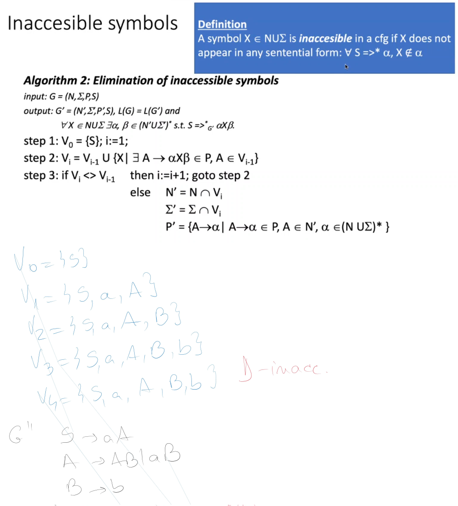
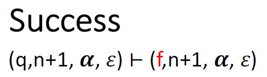
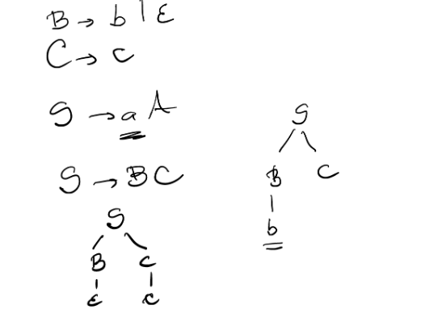
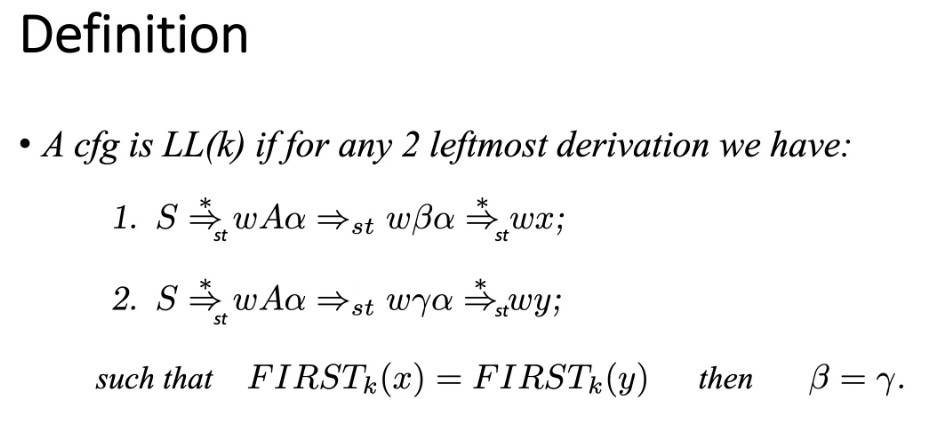
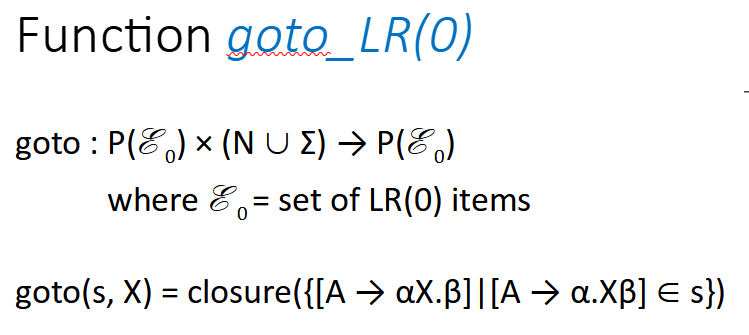
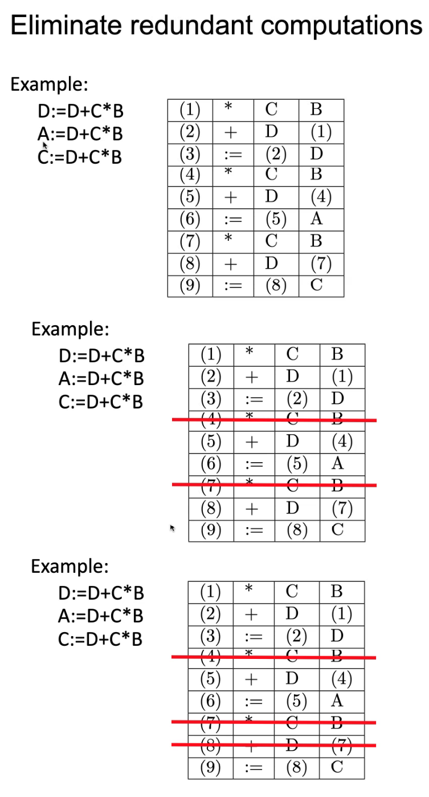
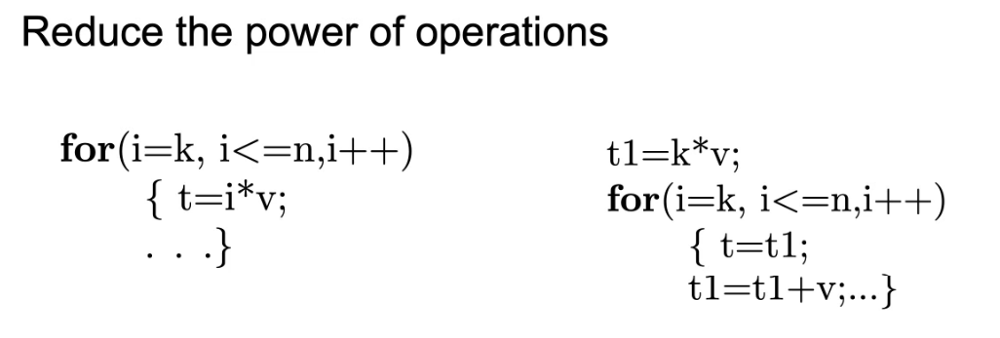

FLCD

# Contents

- [Contents](#contents)
- [Week 1](#week-1)
	- [Lecture 1](#lecture-1)
	- [Structure of a compiler](#structure-of-a-compiler)
		- [Analysis](#analysis)
		- [Synthesis](#synthesis)
		- [Other components](#other-components)
	- [1. Scanning](#1-scanning)
		- [Detect](#detect)
		- [Classify](#classify)
	- [Seminar 1](#seminar-1)
		- [How to specify a language](#how-to-specify-a-language)
		- [Notations](#notations)
	- [1. BNF constructs](#1-bnf-constructs)
	- [2. EBNF - extended BNF](#2-ebnf---extended-bnf)
- [Week 2](#week-2)
	- [Lecture 2](#lecture-2)
	- [Symbol table](#symbol-table)
	- [Formal languages - Basic notions](#formal-languages---basic-notions)
	- [Grammar](#grammar)
	- [Seminar 2](#seminar-2)
- [Week 3](#week-3)
	- [Lecture 3](#lecture-3)
	- [Finite automata](#finite-automata)
		- [Relations between configs](#relations-between-configs)
		- [Language](#language)
		- [Representation](#representation)
	- [Regular languages](#regular-languages)
		- [Regular grammars](#regular-grammars)
			- [Theorem 1: RG \<=> FA](#theorem-1-rg--fa)
			- [Theorem 2: FA \<=> right linear grammar](#theorem-2-fa--right-linear-grammar)
		- [Regular sets](#regular-sets)
		- [Regular Expressions](#regular-expressions)
		- [Remarks](#remarks)
		- [Example](#example)
		- [Algebraic properties of regex](#algebraic-properties-of-regex)
		- [Regex equations - systems](#regex-equations---systems)
	- [Seminar 3](#seminar-3)
- [Week 4](#week-4)
	- [Lecture 4](#lecture-4)
		- [Lemma 1](#lemma-1)
		- [Lemma 2](#lemma-2)
		- [Theorem](#theorem)
		- [Theorem](#theorem-1)
			- [Lemma 1'](#lemma-1-1)
			- [Lemma 2'](#lemma-2-1)
	- [Seminar 4](#seminar-4)
- [Week 5](#week-5)
	- [Lecture 5](#lecture-5)
		- [Pumping Lemma](#pumping-lemma)
		- [How to prove that a lang is not reg](#how-to-prove-that-a-lang-is-not-reg)
		- [Context free grammars](#context-free-grammars)
		- [Syntax tree](#syntax-tree)
		- [Property](#property)
		- [Ambiguous grammar](#ambiguous-grammar)
		- [Parsing syntax analysis modeled with cfg](#parsing-syntax-analysis-modeled-with-cfg)
		- [Equivalent transformation of cfg](#equivalent-transformation-of-cfg)
	- [Seminar 5](#seminar-5)
		- [Regular expressions in finite automata](#regular-expressions-in-finite-automata)
		- [Regular expressions equiv with finite automata](#regular-expressions-equiv-with-finite-automata)
- [Week 6](#week-6)
	- [Lecture 6](#lecture-6)
		- [Parsing](#parsing)
		- [Descendent recursive parser (15:10)](#descendent-recursive-parser-1510)
		- [Formal model - Configuration](#formal-model---configuration)
		- [Expand](#expand)
		- [Advance](#advance)
		- [Momentary insuccess](#momentary-insuccess)
		- [Back](#back)
		- [Another try](#another-try)
		- [Success](#success)
		- [Algorithm](#algorithm)
		- [w in L(G) how:](#w-in-lg-how)
		- [LL(1) parser](#ll1-parser)
		- [First k](#first-k)
		- [Algorithm 36:00](#algorithm-3600)
		- [Follow](#follow)
	- [Seminar 6](#seminar-6)
- [Week 7](#week-7)
	- [Lecture 7](#lecture-7)
		- [LL(k)](#llk)
	- [Definition](#definition)
		- [Theorem](#theorem-2)
		- [LL(1) parser](#ll1-parser-1)
		- [2. Construct LL(1) parse table](#2-construct-ll1-parse-table)
			- [Rules](#rules)
		- [Define configs and moves](#define-configs-and-moves)
		- [LL(1) configs](#ll1-configs)
		- [Moves](#moves)
		- [Algorithm](#algorithm-1)
		- [Remarks](#remarks-1)
		- [More examples](#more-examples)
	- [Seminar 7](#seminar-7)
- [Week 8](#week-8)
	- [Lecture 8](#lecture-8)
		- [LR(k) parser](#lrk-parser)
		- [Definitions](#definitions)
		- [LR(k) Principle](#lrk-principle)
		- [States](#states)
		- [Constructing the LR(k)](#constructing-the-lrk)
		- [LR(0) parser](#lr0-parser)
		- [Function](#function)
		- [Canonical collection](#canonical-collection)
		- [Example](#example-1)
		- [Construct LR(0) table](#construct-lr0-table)
		- [Rules and remarks](#rules-and-remarks)
		- [Define configs and moves](#define-configs-and-moves-1)
		- [Moves](#moves-1)
		- [LR(0) algorithm](#lr0-algorithm)
	- [Seminar 8](#seminar-8)
		- [Recursive descendant](#recursive-descendant)
- [Week 9](#week-9)
	- [Lecture 9](#lecture-9)
		- [LR(k) parsing](#lrk-parsing)
		- [Closure](#closure)
		- [Goto](#goto)
		- [SLR parsers](#slr-parsers)
		- [Construct SLR table](#construct-slr-table)
		- [Rules for SLR table](#rules-for-slr-table)
		- [Example](#example-2)
		- [Remarks](#remarks-2)
		- [Parse seq](#parse-seq)
		- [Config](#config)
		- [Moves](#moves-2)
		- [LR(1) parser](#lr1-parser)
		- [Construct LR(1) table](#construct-lr1-table)
		- [Remarks](#remarks-3)
		- [Configs and moves](#configs-and-moves)
		- [Config](#config-1)
		- [Rules](#rules-1)
		- [LALR parser](#lalr-parser)
		- [LALR parsing](#lalr-parsing)
		- [Parsers recap](#parsers-recap)
	- [Seminar 9](#seminar-9)
		- [LL(1)](#ll1)
		- [First](#first)
		- [Follow](#follow-1)
		- [The parse table](#the-parse-table)
		- [Parse the seq](#parse-the-seq)
- [Week 11](#week-11)
	- [Lecture 10](#lecture-10)
		- [Lex](#lex)
		- [Input file format](#input-file-format)
		- [Execute](#execute)
		- [Example](#example-3)
		- [Yacc - yet another compiler compiler](#yacc---yet-another-compiler-compiler)
		- [Example](#example-4)
		- [Conflicts](#conflicts)
		- [Execution](#execution)
		- [Example](#example-5)
	- [Seminar 10](#seminar-10)
		- [LR(k) Parsers](#lrk-parsers)
	- [SLR](#slr)
- [Week 12](#week-12)
	- [Lecture 11](#lecture-11)
		- [Push Down Automata (PDA)](#push-down-automata-pda)
		- [Configuration and moves + language accepted](#configuration-and-moves--language-accepted)
		- [Representation](#representation-1)
		- [Examples (and representations)](#examples-and-representations)
		- [Some props](#some-props)
		- [Semantic analysis](#semantic-analysis)
		- [Semnatic analysis](#semnatic-analysis)
		- [Attribute grammar](#attribute-grammar)
		- [Evaluate attributes](#evaluate-attributes)
		- [Steps](#steps)
	- [Seminar 11](#seminar-11)
		- [LR1](#lr1)
- [Week 13](#week-13)
	- [Lecture 12](#lecture-12)
		- [Generate intermediary code](#generate-intermediary-code)
		- [Representation of intermediary code](#representation-of-intermediary-code)
		- [3 address code](#3-address-code)
		- [Special cases](#special-cases)
		- [Examples](#examples)
		- [Optimized intermediary code](#optimized-intermediary-code)
		- [Generate object code](#generate-object-code)
		- [Solutions](#solutions)
	- [Seminar 12](#seminar-12)
	- [Lecture 13](#lecture-13)
		- [Turing machines + Exam info](#turing-machines--exam-info)
		- [Def](#def)
		- [Ex - palindrome over {0, 1}](#ex---palindrome-over-0-1)
	- [Seminar 13](#seminar-13)
		- [PDA](#pda)
	- [Attribute grammars](#attribute-grammars)
- [Notes](#notes)
	- [Grammars and languages](#grammars-and-languages)
	- [Finite automata](#finite-automata-1)
	- [Equivalences - finite automata \<=> regular grammars \<=> regular expressions](#equivalences---finite-automata--regular-grammars--regular-expressions)
		- [1. FA \<=> RG](#1-fa--rg)
		- [2. RE \<=> RG](#2-re--rg)
		- [3. RE \<=> FA](#3-re--fa)
	- [Descendant recursive parser](#descendant-recursive-parser)
		- [Configuration](#configuration)
		- [Expand](#expand-1)
		- [Advance](#advance-1)
		- [Momentary insuccess](#momentary-insuccess-1)
		- [Back](#back-1)
		- [Another try](#another-try-1)
		- [Success](#success-1)
	- [LL(1) parsing](#ll1-parsing)
		- [Configuration](#configuration-1)
		- [1. FIRST](#1-first)
		- [2. FOLLOW](#2-follow)
		- [3. Parsing table for LL(1)](#3-parsing-table-for-ll1)
		- [4. See if a sequence is accepted](#4-see-if-a-sequence-is-accepted)
	- [LR(0) parser](#lr0-parser-1)
		- [1. Compute the canonical collection](#1-compute-the-canonical-collection)
		- [LR(0) parsing table](#lr0-parsing-table)
		- [Parse the sequence](#parse-the-sequence)
	- [SLR](#slr-1)
	- [PDA](#pda-1)
		- [Configuration](#configuration-2)
	- [Attribute grammars](#attribute-grammars-1)
		- [Evaluation](#evaluation)
		- [Code](#code)
- [Exam](#exam)
- [Seminars](#seminars)

----------------------------------

# Week 1

## Lecture 1

- compiler - transforms the source code/ program into the object code/ program (it is not directly an executable) and is like a translator
- interpreter - analyzes the code line by line (statement by statement), to see if it is error free and simulates the execution (using the heap and stack)
- assembler - can translate only assembly language into machine code
- BNF - Backus Naur form - syntax of the language
- McCarthy introduced the garbage collector
- Java compiler generates java bytecode and runs it in a java virtual machine
- each phase of a compiler is an equivalent transformation and this guarantees that what you write in the source code will be generated in the object code

## Structure of a compiler


### Analysis

- analyse -> no error lexical, syntactical, semantical
- lexical analysis -> phase when you are looking at the source as a string of chars and which is split into tokens
- syntactical analysis -> parsing if the syntactical rules are applied and if yes, it constructs the syntax tree
- identifier - value
- semantic analysis -> add semantical info to the node

- The output of the lexical and syntax analyzer can be stated as: token stream, parse tree

### Synthesis

- semantic > intermediate (~8)
- intermediate code generation -> generate intermediary code (simple code where the statements have 2 operants and 1 operation) in which we simplify the statemants in the adnotated syntax tree
- intermediary code optimization -> optimize the intermediary code (not necessary )
- OBS - postpone the characteristics of the machine up to the last phase
- object code generation -> allocate registers and select the statements that are going to be executed on the machine

### Other components

- error handling 
  - collection of operations typical to the types
  - lexical error - missing ' or identifier that starts with a number
  - syntactical error - missing ;
  - semantic error - type mismatch
- symbol table - all symbolic names introduced by the programmer
- symbolic names
  - indentifiers: names given by the programmer to introduce variables, functions, classes
  - non-identifiers: constants (id = exp)
- one entry for the identifiers in the symbol table

## 1. Scanning

- treats the source program as a sequence of chars, _detect_ lexical tokens, classify and codify them
- input: source
- output: **pif + st** (program internal form + symbol table)

### Detect

- detect the tokens from separators (invisible - spaces, tabs; visible - dots, commas)
- look-ahead - look at the next token and see if they together form a token (like the "==" for equality)

### Classify

- keyword - can be overwritten 
- reserved word - you are not allowed to change them
- if token is not classifiable => lexical error

## Seminar 1
- [pdf](./Seminar/FLCD%20Seminar%201%20-%20935.pdf)

- BNF (Backus Naur form) language grammar - http://www.cs.utsa.edu/~wagner/CS3723/grammar/examples2.html

### How to specify a language

- mini-programming lang

### Notations

- using meta language (above usual stuff)
- natural language (it is incomplete, inconsistent, interpretable - ambuguity)
- search for a formal notation => BNF

## 1. BNF constructs

- meta-linguistic variables (non-terminals) - between <>
- lang primitives (terminals) - no special notation
- meta linguistinc connectors ::= - equals by def, | alternative/ or
- ex: \<construct> ::= expr1 | expr2 | ... | exprn <- combination of terminals and non-terminals

ex 2. define a signed or unsigned number
- 0 not signed
- numbers should not start with 0

\<number> ::= 0 | \<sign>\<nr> | \<nr>
\<nr> ::= \<nonZeroDigit> | \<digitSeq>
\<digitSeq> ::= \<digit> | \<digit>\<nonZeroDigit>
\<nonZeroDigit> ::= 1 |2 |...|3
\<digit> ::= 0 | \<nonZeroDigit>
\<sign> ::= + | -

## 2. EBNF - extended BNF

- Wirth's dialect
  - non-terminals loose angle brackets and written without delimiters
  - terminals are written between ""
  - ::= is =
  - {} - repetition 0 or more times
  - [] - optionality
  - () - grouping
  - (\*\*) - comments
  - rules end with .

ex 2 in EBNF
number = 0 | ["+"|"-"]\("1"| "2" | ... | "9") | {"1"| "2" | ... | "9"}

or

number = "0" | [sign] nonZeroDigit {digit}
nonZeroDigit = ("1" | ... | "9")

compute de max/min of 3 numbers;

Notations idk

- https://www.cs.sfu.ca/~cameron/Teaching/383/BNF.html
- https://www.w3.org/Notation.html
- https://help.sap.com/viewer/de2486ee947e43e684d39702027f8a94/2.0.04/en-US/50ef74d1ca0b40699b08ba2cd753f3f9.html
- http://matt.might.net/articles/grammars-bnf-ebnf

----------------------------------

# Week 2

## Lecture 2
- [PDF](./Lectures/L2/Course2.pdf)
- [Moodle - Course 2](https://moodle.cs.ubbcluj.ro/pluginfile.php/28877/mod_resource/content/1/Course2.pdf)


**Codify**

- no need to be concerned about the space this will occupy
- you need to know that you have an identifier, not its called
- codification: find the identifier and constants and rename them with "identifier" and "constant"
- you need to preserve ident a or b so place them in the symtable
- PIF - program internal form = an array of pairs of: pairs(token, position in symtable)
- if pair not identifier or constant - position 0 or -1, or any other invalid position depending on the position with which you start the symtable 

- in the alg: if reserved word etc - generate a pair and add it to the symbol table 
- most important op on the st: search and insert

**OBS**
1. the message "lexical error" -> if you can't classify the token
2. ex: if - reserved word but is also a correct identifier ===> *be careful how you put the conditions*

- you need to verify the wordlist to identify the reserved words and etc.

## Symbol table
- contains all the info of the symbolic names (for now: identifiers, ct) - created in scanning and updated in all the phases
- the symtab can be unique - contains all symbolic names, or distinct - divided into ident table, constants table
- the ct symtable can be divide into string symtable or int symtable etc.

**Organization** - search and insert
- unsorted table - O(n) - order of detection
- sorted (alphabetic/ numeric) - O(lg n)
- binary search tree (balanced) - O(lg n)
- hashtable - O(1) - invented for symtables in compilers

**OBS**
- on hastable - solve the conflicts: (two solutions: open bucket - go outside the table or closed bucket - stay in the table)
	- using linked lists on the position
	- open addressing - find the first empty position and have a link to that position
	- bigger data structure and rehash with another key or other hashing related things

**Visibility domain**
- each module has a scope
- *each scope has a separate st, as the identifiers change*
- structure -> inclusion tree - you can use the global variables (this depends on the compiler) and the root of the tree is *main* 
- if g is defined in f -> the inclusion tree is main > f > g => extra complexity of the scanners

- declare function -> compiler will declare the activation table

## Formal languages - Basic notions

- formal language - is a set
ex: L = {a^nb^b| n > 0} = {ab, aabb, aaabbb, ...}
L' = {01^n| n >= 0} = {0, 01, 011, ...}

*A boy has a dog*
- S - sentence
- PV - verb part
- N - noun
- V - verb
- V -> QC
- C -> BN
- B - article

- some sentences are not semantically correct (don't make sense) => you can't control the meaning through these rules

- A -> alpha: alpha rule
- non-terminal symbols: don't appear in the final result (sentence)
- a, boy, dog, has = terminal symbols: appear in the language and you can make a sentence

**OBS**
- sentence = word, seq (contains only termnal symbols) is denoted by w
- a sequence of non terminals and terminals which is a sentential form and what we want is to reach the sentence formed only from terminals 
- the rule guarantees only the syntactical correctness

## Grammar

> *Def* A formal grammar is a 4-tuple: G = (N, sum, P, S)<br>
> N - set of non-terminal symbols, *finite*<br>
> sum - set of terminal symbols (alphabet), *finite*<br>
> P - finite set of productions (rules), with the propriety: P⊆(N∪Σ)∗N(N∪Σ)∗X(N∪Σ)∗<br>
> S in N - start symbol/ axiom

- X => carthesian product

- [closure](https://en.wikipedia.org/wiki/Closure_(mathematics)) - a set is closed under an operation if performing that operation on the members of the set will always produce a member of the set <br>
A* = transitive and reflexive closure = {a, aa, aaa} and {a^0}<br>
A+ = concatenation - the elements can be concatenated as many times <br>
*Notation:* x^0 = epsilon - the empty word - the word contains no symbols, no characters

**OBS**
1. (α,β)∈P is a production denoted α→β
2. terminal and non-terminal sets are distinct N ∩ Σ= ∅

3. dealing with finite sets and we can describe infinite -> set of production is finite and we can define finite alphabets
4. P - the lhs says that the product must contain at least one non-terminal symbol and it can contain any combination of term and non-term and the result will be a subset


**Binary relations**<br>


*Direct derivation* (is Remark 2 on the example)
- from any sentential form, we can replace anything according to the production

*k derivation*
- sequence of direct derivations

*+ derivation*
- at least one derivation

*\* derivation*
- we either have a + deriv or 0 deriv

*0 derivation*
- it is equality

> *Def* **Language generated by a grammar G** is a formal lang described using production rules:<br>
> L(G)={w∈Σ∗| S ⇒w}
- all operations that exist for sets, exist for formal languages
- concatenation = combine the elements from the sets

> *Def* Two grammars are equiv if they generate the same language


**Chomsky hierachy**
- pg 17/ Course2
- https://en.wikipedia.org/wiki/Noam_Chomsky

- context dependent grammar: ex if A appears in the context of x1 and y1, then replace it with gamma: application in linguistics
- context free grammar: no context needed, ex: A can be replaces with alpha, no matter the context (meanning not depending on the context)
- regular grammars - any production has the form given

**OBS** - type3 included in type 2 included in type 1 included in type 0

**Notations**<br>


- alpha, beta, etc. are sentential forms 


## Seminar 2

- [Pdf](./Seminar/FLCD%20Seminars%202%20-%20935.pdf)

- what to do at the labs: spec in detail the language
- tokens = reserved words, separators, operators
- define what is a valid identifier and what is not
- spec first in eng and then with bnf and ebnf

**Specification of programming language**

EBNF rules for ident and ct
- identifiers = letter{alphanumeric}
alphanumeric = "0" | ... | "9" | "A" | ... | "Z"| "a" | ... | "z" 


- scanner takes in a list of tokens (some text file)


- pif contains a column for the token and a column for the position in the symbol table. if the token cannot be classified, an invalid position is added
- symbol table - only identifiers and constants
- in the pif, you write "id" or "const" when a valid ident or constant appears and name it in the symbol table

----------------------------------

# Week 3

## Lecture 3
- [PDF](./Lectures/L3/Course3Final.pdf)
- [Moodle Lecture 3](https://moodle.cs.ubbcluj.ro/pluginfile.php/29402/mod_resource/content/1/Course3Final.pdf)

## Finite automata

**Intuitive model**

- reading head - on the first letter
- the machine has a central unit that will decide wether we can process symbol "a" 
- if we are in the initial state (q0), then we can process it and if we process it, we move to the next state
- in the end: reach a final state if accepted, or another state if not accepted

> *Def* A finite automaton (FA) is a 5-tuple M = (Q,Σ,δ,q0,F) where:
> - Q - finite set of states (|Q|<∞)
> - Σ - finite alphabet (|Σ|<∞)
> - δ – transition function : δ:Q×Σ→P(Q)
> - q0 – initial state q0 ε Q
> - F⊆Q – set of final states

**OBS**
- final states can be more
- delta: takes a state and a symbol and go to another state (the result may not be unique -> go to one state q and one state p): set of all states and nonterminals and goes to the power set of Q (set of **ALL** state)
- transition function - alway takes state and symbol and will go to another state; result may not be unique and delta(q, epsilon) = p is not allowed - you can't go from the empty sequence to another state
- the finite automata needs to process **only one** symbol at any time
- finite to infinite ???
- if at most one result/ state (\<= 1) -> *deterministic finite automata*, otherwise *nondeterministic*

**Property**: for any non-deterministic finite automata (NFA) M, there exists DFA M' equiv to M

**Configuration** C=(q, x)
- config is a snapshot of the state of the central unit and what I have last on the input band (what was left)
- q - state
- x - unread sequnce from input x in sum*
- initial config: (q0,w) , w - whole sequence
- final configuration: (qf ,ε) , qf ∈ F, ε –empty sequence (corresponds to accept)

### Relations between configs

*move/ transition (simple, one step)*
- notation |-
- if in state q and you have left on sequence ax, then look at th etransition function and move to p and if find that delta(q, a) is p

*k move*
- seq of k simple transition

*+ move* 
- at least one move

*\* move* 
- 0 or more move

### Language
- finite automanta: initial state and seq of symbol
- about grammars: language is generated by the grammar (start from the symbol), while in finite automata, we start from the state and the sequence
> *Def* Language accepted by FA M = (Q,Σ,δ,q0,F) is: L(M)={ w ∈ Σ∗ | (q0,w) ⊢ (qf ,ε) , qf ∈F }

**OBS**
- M1, M2 are equiv if they accept the same language
- epsilon is in L(M) <=> initial state is final state

### Representation

- list of all elements with the results of the transitions and the final states
- table - first one is the initial state
- graphical repr - arrow is initial state, double circled state is final state

***Example***
Check if aab is accepted by the automata
(p, aab) |- (q, ab) |- (q, b) |- (r, epsilon)
=> aab accepted, we get to a final state

Check if aba is accepted by the automata
(p, aba) |- (q, ba) |- (r, a) => aba not accepted, we don't get to a final state (you can't go anywhere f from r)


## Regular languages

> regex <=> finite automata <=> regular grammars

- used in:
1. Search engines
2. Unix commands
3. Programming languages

**Comparison between grammar and finite automaton**


- reg exp are equiv with finite automata and regular grammars => the proof is constructive
- the left linear grammar thing is: 

### Regular grammars

- G = (N, sum, P, S) **right linear grammar** if for any p in P: A->aB or A->n, where A, B in N, a, b in sum

- G = (N, sum, P, S) **regular grammar** if:
	- G right linear
	- A→𝜀 ∉ P (epsilon production), with the exception that S →𝜀 ∊ P, in which case S does not appear in the rhs (right hand side) of any other production

- L(G) = {w in sum*|S=>*w} - right linear language


**Example**

S->aA| epsilon; A->a regular<br>
S->aS| aA; A->bS|b regular<br>
S->aA; A->aA|epsilon NOT regular<br>
S->aA| epsilon; A->aS NOT regular<br>

- the last two examples are not regular because S or A -> epsilon appears in another production


#### Theorem 1: RG \<=> FA
- if we have a regular grammar G, we have an equivalent finite automaton M, then L(G) = L(M)
- we have the elements of the grammar and want to create the finite automata using the items from the grammar
- the set of states - the set of non-terminals + a fresh symbol K (not used as a non-terminal), K will be the final state
- initial state - starting symbol
- the set of final states contains the new symbol K and the epsilon productions
- the transitions are based on the productions of the grammar:
  - if A -> aB in P, then delta(A, a) = B
  - if A -> a in P, then delta(A, a) = K (final state)
- proof by double inclusion:


- don't skip K from representations
  


#### Theorem 2: FA \<=> right linear grammar
- **OBS** any right linear grammar can be transformed into a regular one
- we have the automaton and we want to construct the grammar
- construct N, S, P 
- set of nonterminals - set of states
- set of terminals - alphabet
- starting symbol - initial state
- productions:
  - delta(q, a) = p, then q -> ap in P (1)
  - p in F (final states), then q -> a in P (2)
  - q0 in F, then S -> epsilon
- if the set of states is final, for each transition we add 2 productions in the grammar, that is (1) and (2) from above
- prove by double inclusion 


### Regular sets
- defined in a recursive way

<br>

- {a} - any symbol from the alphabet is considered a regular set
- operations allowed: union (+ - or), concatenation, * - transitive and reflexive closure

### Regular Expressions

<br>

### Remarks
1. p+ = pp* (appears at least one time)
2. use paranthesis to avoid ambiguity
3. priority of operations: *, concatenations, + (high to low)
4. for each regular set, we can find at least one regex to denote it (there is an infinity of regex denoting them)
5. for each regex, we can construct the corresp regular set
6. ***2 regex are quiv <=> they denote the same regular set***

### Example

- (0+1)\* - 0 or 1, repeated 0 or more times, denotes {epsilon, 0, 1, 00, 11, 01, 10...} - infinite

- 0\*1\* - 0 and 1, repeated 0 or more times, denotes {epsilon, 0, 1, 01, 00, 11, ...} - infinite

### Algebraic properties of regex


### Regex equations - systems
- to solve them, we need to make them of the form X = aX + b, where a, b regex
- if we have that form, the solution is X = a*b
- systems - use substitution


## Seminar 3
- [Seminar 3](./Seminar/FLCD%20Seminar%203%20-%20935.pdf)
- [Drive Seminar 3](https://docs.google.com/document/d/1MGUVN80_BmpLAribK8LekGztubMXUYO9dPT0DF1D0To/edit?usp=sharing)


- getting that damn presence eh

- S is an element of N, non-terminals
- each production is a rule, having a rhs and lhs

rhs - N U sum \*
- N U sum \* - reflexive and transitive closure, the set of all seq which have elements of 

the lhs 
- concat with the null term and ending subseq -> need to have at least one non-terminal 

- if a pair is in the set o productions, alpha -> beta
- context free - lhs has single non-terminal in each lhs production

**Derivations**
- bin relation def on 
- find the left hs in the seq, change with the corresp rhs and get a new seq, where x -> y is production
- now we define the language - set of all seq over the alph of the grammar - only consists of terminals with the prop that the seq can be optaining from sum\*

> **OBS** Counting the productions: the vertical bar = alternative -> the rhs and lhs are different productions, so you count them both (ex 1)


[The exercices](https://docs.google.com/document/d/1MGUVN80_BmpLAribK8LekGztubMXUYO9dPT0DF1D0To/edit?usp=sharing)

***Example 1***
1. Is not a context-free grammar (we have CS in the lhs of one production)
2. has 5 productions

Text: N = {S, C}
sum = {a, b}
P:
1. S -> ab | aCSb
2. C -> S | bSb
3. CS -> b
prove ab(ab^2)^2 seq is from the language
form = ababbabb

a^2b^2=aabb diff (ab)^2= abab
- this is concatenation
  
S =>(2) aCSb =>(4) abSbSb =>(1) this done 2 times ababbabb = w
this is a star derivation and a derivation of order 4 

=> S =>(R) or order 2 w = ab(ab^2)^2 in L(G)

***Example 2***
P: S -> a^2S | BC
find L(G)

L = a^(2k) bc, k in N
- proof by double inclusion 
  
1. L is subset of L(G)
2. L(G) subset of L


- if there are more variables in the grammar, split the problem in smaller parts and prove each using induction; fix the variables and see what properties can be used (they can be discarded afterwards)
- same goes for the second part, proving that L(G) is a subset of L, show that the grammar can generate the certain tree we are looking for and then concat them 

Seminar 3 problems

\1.  (50 points) Show that all binary strings generated by  the grammar with the following productions have values divisible by 3
S -> 11 | 1001 | S 0 | SS

2. (50 points) Construct a cfg for L = {a^nb^mc^k | k=n+m}

3. (50 points) Construct a cfg for L = {w in {a,b,c}* | noa(w) = nob(w) = noc(w)}, where noa(w)  denotes number of symbols 'a' in the sequence 'w'


- conext free grammars and stuff from the dragon book
- https://people.cs.nctu.edu.tw/~wgtzeng/courses/FL2017SpringUnder/HW3-Solutions-2017-Spring.pdf
- https://www.allegro.cc/forums/thread/602679
- https://stackoverflow.com/questions/53244426/context-free-grammar-for-the-language-l-anbmck-m-i-k
- https://math.stackexchange.com/questions/1963737/the-context-free-grammar-for-language-l-anbmck-mid-k-n-m-n%E2%89%A50-m%E2%89%A50
- https://stackoverflow.com/questions/1021882/how-can-i-construct-a-grammar-that-generates-this-language
- https://github.com/fool2fish/dragon-book-exercise-answers/blob/master/ch02/2.2/2.2.md
- https://github.com/fool2fish/dragon-book-exercise-answers
- http://dragon-book.jcf94.com/book/ch02/2.4/2.4.html
- https://www.studocu.com/ro/document/universitatea-din-craiova/programarea-calculatoarelor-si-limbaje-de-programare/note-de-curs/subiecte-lfa/3858305/view
- https://web.stanford.edu/class/archive/cs/cs103/cs103.1142/lectures/13/Small13.pdf
- https://math.berkeley.edu/~arash/55/9_4.pdf
- https://people.cs.nctu.edu.tw/~wgtzeng/courses/FL2017SpringUnder/

---

# Week 4

## Lecture 4
- [PDF](./Lectures/L4/Course%204.pdf)
- [Moodle Lecture 4](https://moodle.cs.ubbcluj.ro/pluginfile.php/29822/mod_folder/content/0/Course%204.pdf?forcedownload=1)

**Prop** - regular sets are right linear languages
- Regular set - set corresp to a regular expression
- Right linear language - set corresp to right linear grammars

### Lemma 1
Proof
1. If we have the empty set, the language is the empty set
2. To have the next simple regex, epsilon, we have one production, s-> epsilon
3. Simple grammar: S-> a the only production


### Lemma 2
- if L1, L2 are right linear language then: L1 U L2, L1L2 and L1* (Kleene closure) are right linear languages


**Examples**

*Ex 1 - union*

- if from S3 you want w1, go to S1. If from S3 you want to generate w2 too, go to S2
- this can happen only if you have S3 -> S1|S2 productions but the grammar must be right-linear and you need the productions to be the form in the image 
- if you don't have the productions like that, borrow them to S3
- you add the productions as they are presented in the written example


*Ex 2 - concatenation*

- in G4 - L1L2 concatenation
- construct a grammar that generatore w1w2
- first generate S1, go through the derivations, generate w1 and then go to s2
- production An -> an (last derivation) modif An -> anS2 and can continue with the productions for S2
- but there is a special situation: when epsilon belongs to a language
- pp epsilon in L2 if S2 -> epsilon (not a regular grammar but it is a right linear grammar) -> construction works fine
- if epsilon in L1 if S1 -> epsilon (not a regular grammar but it is a right linear grammar), then we can do this: S1 -> xf, S1 -> epsilon in P1, S2 -> x in P2


*Ex 3 - transitive and reflexive (Kleene) closure*

- G5: L1* 
S1 -> aA | b
S1 => a1A1 => .... => 
- transitive - any w in the grammar can be repeated, concatenated: if w1 in closure, then w1w1 in closure - it means that G1 concat w/ G1
- reflexive: L1 ^0 = {epsilon}, S1 -> epsilon - right linear grammar but not a regular grammar
- you invent a new symbol S5 and do like in case of union - borrow to S5 all the productions that S1 had and go back to S1 for the case you obtain the productions


**Examples - union, concatenation, reflexive and transitive closure**
- lecture 4 1/2 30:00

1. Union (30)
2. Concatenation (37)
- **OBS** - right linear grammar -> only A -> aA and A -> a
3. Closure (40)


### Theorem
- from any regex, we can construct a regular grammar


**Example - REGEX EQUATIONS**
- lecture 4 1/2 46:00
- replace and solve one eq, then come back to the result
- we need to reach the form X = aX + b (!), so just replace in one equation every nonterminal
- it doesn't matter if you have another nonterminal in the resulting equation, as long as you have something like (1), then you just write the solition X = a*b, where the free term b will contain that nonterminal
- then replace further (in this case, in S = ...) and reduce to form (1)


### Theorem 
- how to construct a system of equations for finite automata
- searching for solutions to the final state -> union of solutions
- you take into consideration all the arrows that enter the state and the terms will be like in the picture below
- for the initial state, the term is epsilon
- the equations will have the form X = Xa + b and the solution is X = ba*
- CONCATENATION IS NOT COMMUTATIVE


**Example**
- we need a solution for certain states (not all)
- search the solutions for the final states
- if there are more, make a union of them


#### Lemma 1'
1. language is the empty set - no final states
2. epsilon - initial state is also final, might have no transitions
3. if I want a symbol a to be the language generated by the automata, you need two states, an initial one and a final one and have one transition from q0 to q1 labelled with that a


#### Lemma 2'


- lecture 4 2/2 15:00 - whiteboard

*Ex 1 - union*

- preserve the symbols (15:00)
- borrow the transitions from q01 and q02


*Ex 2 - concatenation*

- explanation at around 22, but no image
- all the final states in the transition in the first automata, will borrow the transitions that were corresp to the initial state in the second automata
- the final states: final states for the second automata and the final states of the first automata if the initial state for the second automata is also a final state for the second automata


*Ex 3 - transitive and reflexive closure*
- 28
- it needs to contain all the seq w1 repeated 0 or more times
- repeated 0 times - we need epsilon - initial state must be final
- repeated more times - concatenation of M1 with itself, so you need to add a transition like in the picture


## Seminar 4
- [Seminar 4](./Seminar/S4/FLCD%20Seminar%203%20-%20935.pdf)
- [Drive Seminar 4](https://docs.google.com/document/d/1JmMVB-r8UDKOhx8rMjq9GZ2p35-3ojvoWiIQnXhtitY/edit?usp=sharing)


cardinality of the transition function: dfa = 1 => cardinality at most 1 for any pair consisting of state and symbol
if there is at least 1 state symbol pair for which which is not idk, then it is nda

**Configuration**
- pairs of state and sequence
- sequence from transitive and reflexive sigma
- init config: 
- final config: epsilon (empty seq) => accepted


- there is a move between a config and another if there is a direct transition for that
- language set of all seq over the input alphabet st we have an initial config from w to a final state with epsilon (initial config and find a series of direct moves that end up in the final config)
- ALL PATHS FROM INITIAL TO FINAL STATE
- all the automaton in table: add flag column, the first cell is the initial state


- when a NFA accepts epsilon: add some state as a final state (initial state can be a final state)


- automata: transition functions, transitions
- grammar: productions, derivations
- automata: language accepted
- grammar: language generated

- https://www.ics.uci.edu/~goodrich/teach/cs162/hw/HW1Sols.pdf
- http://suraj.lums.edu.pk/~cs311w05/hw/hw02Sol-updated.pdf
- https://web.njit.edu/~marvin/cs341/hw/hwsoln03.
- https://www.chegg.com/homework-help/give-state-diagrams-dfas-recognizing-following-languages-par-chapter-1-problem-6e-solution-9781133187790-exc
- https://www.geeksforgeeks.org/automata-theory-set-5/
- https://stackoverflow.com/questions/7479064/give-state-diagrams-of-dfas-recognizing-the-following-languages-in-all-parts-th
- https://merascu.github.io/links/SS2019FLAT/Course4_FiniteAutomata_part2.pdf !!!!!
- http://cobweb.cs.uga.edu/~cai/courses/2670/2018fall/2670HW2-Solutions.pdf

---

# Week 5

## Lecture 5
- [Lecture 5](./Lectures/L5/Course5.pdf)
- [Moodle Lecture 5](https://moodle.cs.ubbcluj.ro/pluginfile.php/30051/mod_folder/content/0/Course5.pdf?forcedownload=1)

- decide when a lang is not regular

### Pumping Lemma

- we supp that L is reg lang and there exist a number p in N, if we take a seq the it is long enough (lenght exceeds p), then we can decompose the seq in 3 subsequences x, y, z
- conditions:
	- y contains at least one symbol 
	- y can't be the whole sequence (there exists at least a symbol in x or z that is not in y)
- the pumping part: xy^iz in L, i > 0 should also belong to the language
  


*Proof briefly explained*
- if L reg, there exists a finite automata that will generate L, we choose p as the number of states in the automata
- if seq > p -> one state is visited twice (there is a loop) -> it can be visited any nr of time


### How to prove that a lang is not reg
- the sequence can be decomposed in 3 subseq
- find all the posibities and see if they obey the rules of the language
I. y  = 0^k1^l not in L - not the same nr of symbols for i = 0
II. y  = 0^k1^k not in L - not the same order of symbols for i = 2
III. y = 0^k not in L - not same nr, i = 0
IV. y = 1^k not in L -- not the same nr, i = 0
=> L is not regular
- find at least one seq that contradicts the supp that L is regular


### Context free grammars
- productions of the form A -> alpha, alpha can be any combination of the symbols and A is the only non-terminal in the lhs
- **any reg grammar is a cfg**
- can model programming languages


### Syntax tree
- result of parsing (syntactical analysis)
- a tree corresp to a cfg is obtained as follows
- representation of the way you accept the sequence
- root starting with S
- nodes are labeled with the symbols from the grammar
	- internal - non-terminal
	- leaves - terminal (2.2)
- we obtain the nodes by doing the productions


**OBS**
- a grammar that produces more than one parse tree for some sentence is ambiguous


### Property
- in a cfg, w in L(G) iff there exists a syntax tree with frontier w
- frontier - the leaves traversed from left to right - the frontier is part of the language
- what is on the rhs of S, it becomes a descendant node
- derivation tree - if there is a nonterminal


**OBS**
- constructing syntax tree based on leftmost derivations will NOT result in a different syntax tree than based on rightmost derivations - the tree will have a unique representation

<br>

- leftmost derivation - we look at the sentential form and apply prod on the leftmost nonterminal
- rightmost derivation - same but the rightmost nonterminal
- derivations can't give a unique way of representation (there are at least 2 ways)

**Example**


### Ambiguous grammar
- a cfg is ambiguous if for a w in L(G) there exists two distinct syntax trees with the same frontier w
- the results can be incorrect if operations' priority (order lol) is not respected

**Example**


**OBS**
- grammar for arithm expressions
E -> E + T | T
T -> T*F|F
F-> (E)|a

E - expressions
T - term
F - factor
a - constant or id


### Parsing syntax analysis modeled with cfg
cfg G = 
- N - nonterminals - syntactical constructions - declarations, statements, expression 
- Sigma - elements of terminals: id, ct, reserved words, operators, separators
- P - syntactical rules - expressed in BNF - change to production 
- S - syntactical construction corresp to the program
- then program syntactically correct \<=> w in L(G)


### Equivalent transformation of cfg

- examples for each algorithm below is in the whiteboard file
- lecture 5 2/2 1:38

**Unproductive symbols**
- 1:38
- A non-productive in a cfg id it doesn't generate any sequence
- productive if it generates a seq
- initially, construct some intermediary sets 
- steps:
	1. initialize the sets
	2. saturate - add extra elems to the set until there are no more elems and stop the alg
	3. if the two sets are distinct, saturate again (step 2), otherwise stop the alg
	4. construct the new equiv grammar
- you need to construct the set of productive symbols
- if S is unproductive, the grammar is useless, otherwise 


**Inaccessible symbols**
- 13
- symbols that don't appear in any sentential form 
- similar to the one above
- initialize the set with S
- if A accesible, all the elements in the rhs of the production are accesible




**epsilon productions**
- 19
- eliminate prod A -> eps
- G is without any eps production if there is no A -> eps
- or there exist S -> epsilon and S in not in rhs(p), any p in P
- if in rhs, replace with epsilon
- if we have the production in the lhs, invent a new symbol S' such that S' -> S

*Situation:*
A -> BC
B -> epsilon
C -> epsilon
- you should also eliminate A since it will go to epsilon


**Single productions**
- 31
- A -> B - single production or renaming rule


## Seminar 5
- [PDF seminar 5-7](./Seminar/S4/FLCD%20Seminars%205-7%20-%20935.pdf)
- [Drive seminar 5-7](https://docs.google.com/document/d/1O51r6a15da2QZ16M0pKCiMP88DHLiTako1xAG2OGy4E/edit)

- no epsilon transitions
- avoid eps transitions - label transition with 
- integer - lexical contents: sequences of digits
- syntactical contents: sequences -

3. b exercise
- lexical: no letters 
- the alphabet: tokens from the lexical part, var, comma, idk 
- building automaton - figure out the shortest path (like declaration) and then add the links and loops to add other sequences 


### Regular expressions in finite automata
- signification - searching a pattern 
- is a pattern that covers 
- regular set over a 
- generetated by a grammar
- accepted by a fa
- something regular expresion

- for each finite automata we can build a right linear grammar
- right regular grammar - special type of context free grammars
- regular grammar - can't have the epsilon
- right linearity at most two symbols in the rhs - a A
- epsilon rule - if epsilon, only the starting symbol can have a prod to epsilon and can't appear in the rhs

### Regular expressions equiv with finite automata
- accept the same language as that accepted by the fa
- for each reg gra we can build an equiv finite automata

- adding the symbol - will always be a final state

- we have S as final state because there is epsilon

- transitions out of productions: 
	- just keep the epsilon productions if exists
	- A -> aA: delta(S, a) = {A}
	- delta(A, a) = {A, K} - might go to the final state - the way we write end generating sequences: we send them to the newly added state ()

invers
- we don't always get a regular grammar (might not be epsilon free)
- non-terminals = same with the set of states, no need to add or remove anything
- generating productions: 
	- just take them from the table as they are, with the loops and everything
	- when reaching a final state, end the generation with a terminal
	- the final state is on the right and add the termminal as a production, see the example, jesus
	- when reaching the final state, don't skip the production with the normal state and then add the ones with the terminals only


- right linear but not regular because we have epsilon as the starting symbol and we use that later in other places


# Week 6

## Lecture 6
- [Lecture 6](./Lectures/L6/Course6.pdf)

### Parsing
- top to bottom - until full frontier (descendant)
- bottom to top - from frontier to root (ascendant)

- recursive - take in order each case and we can expect the next element of the frontier, if not, try next, etc. (recursively trying all productions)
- linear - extra computation + associated cost (only once)

- l - left
- r - right
- parser descendant = ll1
- parser ascendant = lalr

**Result**
- arbitrary tree - child sybling representation (left child right sybling) - we need to know what is the order of the child nodes - on whiteboard below, first thing before the horizontal line
- constructed by a seq of derivations from S
- string of production - index associated to prod - which production is used at each derivation step
- you need to know what type of derivation is used (leftmost, rightmost)


### Descendent recursive parser (15:10)


- example after horizontal line
- not efficient for large dimensions
- **steps/ keywords**: expand, advance, momentary insuccess, another try, going back
- start from S and take each production in order: if you get to a momentary insuccess, take the next production and if there are none left, go back
- the path taken is not leading to the right sequence and let's try something else (another try) - other posibility of writting S
- just make momentary insuccesses until you find the right sequence (I guess you can skip some steps)
- we need the whole frontier to be w, so you keep going until you find a terminal and if it is wrong, go back. It doesn't matter if you find the sequence w if you didn't reach/ create the whole frontier, so in this case you need to go back
- if you reach the end of productions and get to a terminal, you can't make another try and just keep going back

- a sequence is not accepted when you go back until you reach the root and you don't have any match for that given terminal or sequence - you can't make decisions when you are in an internal node


### Formal model - Configuration
- configuration - complete snapshot of a moment in the construction of the tree (s, i, alpha, beta), where
- s - state of parsing process
	- q normal state - on the good path and continue constructing the tree
	- b back state
	- f final state (success - w in L(G))
	- e error state (insuccess - w not in L(G))
- i - position in input seq, goes to n + 1 - in order to detect that the frontier is 
- alpha - working stack, stores the way the parse tree is built
- beta - input stack, part of the tree to be built
- initial config (q, 1, epsilon, S) - epsilon = nothing has been constructed yet
-	|| define moves between configurations
- final config (f, n+1, alpha, epsilon) 
- epsilon = no more nodes in the tree 

### Expand


- head of input stack is a non-terminal: state normal and nonterminal is the head of beta, A1 is the letmost child of A (keep track of the production)

### Advance


- current node matches the first symbol of the sequence and we moved to the next one

### Momentary insuccess


- the current terminal symbol doesn't match the sequence

### Back


- when going back and there is a terminal, go back again

### Another try


- try another production (1)
- further go back (2)
- there are no other productions for the root and stop 

### Success



- the sequence is accepted

### Algorithm


- go until you reach a final state with success or final state with error
- the move is depending on the state
- if the state is q (normal), then the state reached is final - artificial - change the state to be the final one
- if head of stack is non-terminal, expand
- otherwise expand or go back
- if state is back, then if the current head is terminal, go back again
- otherwise, make another try: either another productions, or go back
- if state is error, seq not accepted, otherwise success


### w in L(G) how:
- process alpha
	- from left to right (reverse if stored as stack)
	- skip terminal symbols
	- nonterminals - index of prod
- if there are several non-terminals, do something else with the indices

**When the alg never stops**
- left recursive grammar - S -> Salpha expand infinitely on S 

### LL(1) parser
- A can be rewritten in different ways, but we want a unique decision
- linear = make a unique decision = choose the writting of A to the right result
- construct the next symbol from the frontier
- which are the **first terminals** generated from A in order to make the right decision

### First k

- first_k - first k terminal symbols that can be generated from alpha - either u terminals or ux and take the first k symbols
- result: terminals

**Construct first**
- first_1 denoted first
- circled + = concatenation of length 1 btw 2 languages (take only the first symbol of the concatenation)

**Concatenation example** - 20/23


- take only the first symbol of the possible concatenation
- if the first language contains epsilon, consider the symbols from the second language (ai+1 is not generated from beta)





**OBS**
- first(alpha beta) = first(alpha) concat first(beta)
- first(X1X2...Xn) = first(X1) concat ... first(Xn)

### Algorithm 36:00


- add items to the set as much as possible (terminals)
- terminals, and non-terminals = finite sets - assures that the algorithm will finish

### Follow


- ai+1 is not genreated from A, it belongs to what follows from A
- follow k(A) = next k symbols generated after/ following A
- if there is no symbol after B, look at the terminal from the rhs and see if there is anything following B - consider it the follow => c will be put in follow of B


## Seminar 6
- [PDF seminar 5-7](./Seminar/S4/FLCD%20Seminars%205-7%20-%20935.pdf)
- [Drive seminar 5-7](https://docs.google.com/document/d/1O51r6a15da2QZ16M0pKCiMP88DHLiTako1xAG2OGy4E/edit)


- \+ = union
- regex = regular set
- \* - repeated one or more times

- apply the rules from lecture 4 (the lemmas)
- the new grammar should generate all, starting from the first thing 
- to accept seq from both langs, we need to keep the same productions
- we need regular grammar - 
- we go directly to the rhs of s1 or s2
- not accesible - we can erase them and simplify the grammar
- b b+ - at least 2 bs
- b+ - at least one b

# Week 7

## Lecture 7
- [Lecture 7](./Lectures/L7/Course7.pdf)

### LL(k)
- L - left - sequence is read from left to right
- L - left - use leftmost deriv
- k - prediction of length k (the next k symbols that you're looking for when you take the next symbol)

- the production (action) will be uniquely determined - so no need to recursively try the productions
  - (a1, ..., ai) - closed part - we know it was generated
  - A - current non-terminal symbol
  - prediction ai+1...ai+k, k length

## Definition
<br>
1. suppose we have a seq of deriv and we reach sentential form wAa and then we apply the A -> B and we obtain wx
- w in the left - only terminals 
2. if I choose another prod for A, in gamma, we get to wy
- if FIRSTk(x) = y, the B = gamma

- to apply this for programming languages - not an easy task (the grammar must be LL(1) to apply this LL(1) parser)

### Theorem
<br>
- if I have two prod corresp to the same non-terminal, then the condition from below the text is the empty set
- for k = 1, if we have several prods for A, alpha i can be epsilon so we need a FOLLOW
- postopone the alg: start the parsing, try applying ll1, until the conditions are verified, start applying the parser

### LL(1) parser

- prediction of l = 1
- input: grammar and seq
- output: is seq accepted/ program syntactically correct, if yes, start constructing the syntax tree
- steps:
1. construct FIRST, FOLLOW
2. construct parsing table (phases)
3. analyse the seq base on moves between configs - no prev computations
- 1, 2 - computed only once
- one of the most effective ways of using divide and conquer

### 2. Construct LL(1) parse table
<br>

- possible actions depend on:
  - current symbol in the vocabulary of the grammar (terminals and non-terminals)
  - possible predictions (terminals)
- instead of checking if the stack is empty, add a special symbol $ and if you reach that, it means that it is empty
- the table will be constructed as:
  - one line for each symbol in the vocabulaty and $
  - one column for each terminal symbol and $

#### Rules
<br>

1. divided into 2 parts: nonterm and term
	- for each nonterm - see what happens regarding its own predictions - 
	- i = nr of production
	- follow computed only if it exists in the seq
2. for terminals - diagonal
- pop (line and column are the same) - from 2 stacks
3. stacks empty - accepted
4. otherwise error

**Remark**
- a grammar is LL 1 if the table does not contain conflicts - there exists at most one value in each cell


### Define configs and moves
- input:
  - language grammar
  - LL(1) parse table
  - seq parsed
- output:
  - if w in W(G), then string of productions, else error and location of error

### LL(1) configs
- alpha, beta, pi
- alpha - input stack (input seq)
- beta -  working stack 
- pi - output - string of productions

**Initial config**
- alpha contains - the whole seq with $
- beta - the root and $
- pi - epsilon

**Final config**
- alpha contains - $
- beta - $
- pi - result

### Moves
1. *Push* -  head of beta is a nonterminal 
    - pop A and push symbols of beta 
    - take A and replace it with beta (unique), 
    - i is important = we store it in the output, 
    - A is one symbol, beta contains several symbols and when pushing beta, you push all the symbols
2. *Pop* - take off from both stacks - pop the symbols 
3. *Accept* - stacks empty, seq accepted
4. *Error* - otherwise

### Algorithm
<br>

### Remarks
1. ll 1 - provides location of error
2. grammars can be transformed to be LL(1) (first example on whiteboard) - take some factor, introduce a  nonterminal and add a production => no conflicts<br>
<br>
- if we don't have epsilon when A -> alpha, then we can't have epsilon in first(alpha) so no need to compute follow

### More examples
- in case we have A->SA, postpone until S is different from the empty set<br>
<br>
(after if then example)


## Seminar 7
- [PDF seminar 5-7](./Seminar/S4/FLCD%20Seminar%205-7%20-%20935.pdf)
- [Drive seminar 5-7](https://docs.google.com/document/d/1O51r6a15da2QZ16M0pKCiMP88DHLiTako1xAG2OGy4E/edit)
- [Board seminar 7](./Seminar/S7/Board%20935.pdf)


**Finite automata <=> regex**<br>

- split in smaller expressions
- rules corresp to automata
- no overlapping set of state names
- we draw the FA for each element and rules and the transitions are marked with the 
- \+ - **union** - reg set or reg language of the set 0 and 1 - place them under each other
	- we can create a new state and it will be the new initial state (and )
	- we need to accept sequences from both languages (generate from both starting symbols), so transitions from both langs
	- the final states of the new automata are the union of the final states of the two automaton but there is a case when we need to add a new final state: newly added state is final when one of the two languages has epsilon
	- the new starting symbol takes over the transitions of the old starting states (we are not allowed to have epsilon transitions from q0 to q2) - they are inaccessible so they are discarded
	- if in the initial automata you have a transition from q1 to q0, you can keep them (state q0 is not inaccessible)
	- minimize: single transition with 0 and 1 as label

- **concatenation**: 01
	- place automata on left and right
	- initial state: q0 - sequences have in front subseq from the first language and the tail will be the second language
	- final states: keep the final state from the second automata and a special case - if epsilon is part of the second language, we need to keep the final states of the first language
	- transitions: keep all the transitions from both languages and link them as follows: *final states of the first take over all the transitions of the second* (otherwise we have epsilon transitions) and we eliminate inaccessible states


- **reflexive transitive closure (0+1)\***
	- start from the automaton corresp to 0 + 1
	- contains the language itself, epsilon and includes concatenation of the sequences in the languages with themselves
	- initial state: q4
	- final states: q4, q5 - we keep all the states from the automata and we make the initial one final
	- transitions: we need to take over q4 with q5 with 0 and 1
	- this can be minimized to q5 (discard of q4) and the initial state will be q5, so:
		- inital state: q5
		- final state: q5

- 01(0+1)\*
	- initial: q0
	- final states: q3, q5
	- crate a link between q3 with q5, because *we have epsilon in the second language*, we need to keep the final states of the first language
	- minimize: move the loop on q3 and eliminate the rest

- 01(0+1)\*1\*
	- link q5 to q6 with the label 1
	- 1* is included in (0+1)* so we don't need to add the last step


- place the state, then the symbol


https://www.radford.edu/nokie/classes/420/Chap1-4-NonregularLangs.html

# Week 8

## Lecture 8
- [Lecture 8](./Lectures/L8/Course8.pdf)
- [Moodle Course 8](https://moodle.cs.ubbcluj.ro/pluginfile.php/31184/mod_resource/content/2/Course8.pdf)

### LR(k) parser
- rhp - right hand side of the production
- lhp - left hand side of the production
- handle - symbols from the head of the working stack that form in order a rhp
- shift/ reduce:
  - shift symbols to form a handle
  - when rhp is formed, reduce to the corresponding lhp

- ascending parser (tree constructed from leaves to the root)
- linear alg
- put the symbols in the stack and let them wait there
- when you take each symbol, check if it is the rhs of the production and find the corresp lhs and go up one lvl
- if there is nothing else to do, continue with the final sequence
- **keywords**: reduce/ shift (put in the stack/ shift into the stack)
- to write derivations according to the parser: generate the string of productions in reverse order
- uses rightmost derivation
- k is the length of prediction (the next k symbols that you're looking for when you take the next symbol)<br>
<br>
<br><br>

- L - left (seq read from left to right)
- R - right (uses rightmost derivation)
- k - length of prediction
- **enhance grammar** - invent a new symbol S', not appears in the set of terminals with the production S' -> S (equiv grammar), but S' doesn't appear in any rhp

### Definitions
<br>


- we choose the production to be used in a unique way - for a live prefix in a linear way
- live prefix - which are the possible beginnings of the sequences that are generated from S with the prefix
- any prefix from alpha beta will also be a prefix for S and will be called a live prefix<br><br>
*Def 2*
- the dot - specific to this kind of passing (not a symbol from the production) and can be anywhere in the rhs
- u is the prediction (we have already detected alpha)


**OBS**
- A->alpha.beta - kernel
- u - prediction
- if . in the end, rhp detected and apply reduce
- if . in the middle, shift until . reaches the end
- state decides the action (reduce/ shift)
- we will have combinations of state and symbols

### LR(k) Principle
- current state
- current symbol
- prediction - uniquely determines:
  - action to be applied
  - move to a new state
- then LR(k) table has 2 parts: action + goto


### States
- contain: 
    - LR items (the items to be shifted) - MORE - all items that corresp to the live prefix
    - closure

- go from one state to another
	- goto (function) - how to go from one state to another state - live prefix 
	- canonical collection - determine all possible states

**What LR item will be in the same state**
<br>

- construction
- first item corresp to a live prefix gamma alpha
- B internal node - we need a production


### Constructing the LR(k)
- 4 parsers:
	- LR(0) - ignore the prediction
	- SLR - simplified LR(1)
	- LR(1) 
	- LALR (optimized version or LR(1))
<br><br>

- define item
- construct set of states
- construct table
  - thse are executed only once
- parse the sequence based on moves between configs

### LR(0) parser
- prediction ignored - we only have the kernel
1. LR(0) item: [A-> alpha.beta]
2. Construct the set of states<br>
<br>

- is a set
- call the canonical collection algo which will call goto and closure
- what I have in one state and see how to saturate the set<br>

<br>
- the reason of having a goto: go from one state to another state
- state contains all the items corresp to a live prefix
- going to another state means enhancing the prefix (add a symbol X - it can be any symbol from the grammar)
- will take all the elements from S and will try to enhance it with X

### Function


### Canonical collection
<br>
- start from enhanced grammar and we obtain the set of states (the canonical collection)
- initial state - S' -> .S

### Example
<br>

### Construct LR(0) table
- one line for each state 
- 2 parts:
  - action - one column (for a state, action is unique because prediction is ignored)
  - goto - one column for eac symbol X in the vocab

### Rules and remarks
<br>
<br>
- we use the enhanced grammar because...

### Define configs and moves
- input:
  - enhanced grammar G'
  - LR(0) table
  - input seq w
- output:
  - if w accepted in L(G), then return the string of productions, otherwise the error and its location
- alpha - working stack (stores the initial state)
- beta - input stack
- pi - output stack

**Initial config**
- alpha - $s0 - initial state 
- beta - w$ - the sequence
- pi - epsilon


**Final config**
- alpha - $sacc - accepted sequence
- beta - $ - empty
- pi - pi


### Moves
<br>

1. Shift
   - look at the next symbol in the input because we need to compute goto
2. Reduce
	- the handle is at the head of the working stack

### LR(0) algorithm
<br>


## Seminar 8
- [PDF](Seminar/FLCD%20Seminar%208%20-%20935.pdf)
- [Drive Seminar 8](https://docs.google.com/document/d/1CdvGVfdo9N1zbtZWtIBuNdyARKvjBg8y33L0_IkxcAk/edit)
<br><br>

- leftmost vs rightmost deriv in cfg

- in leftmost:
	- extend the leftmost non-terminal
	- target the next (left) symbol in the sequence
- in rightmost: 
	- extend the rightmost non-terminal
- parser returns if the sequence is in the lang and returns a parse tree
- the sequence of numbers that represent the sequence of derivations can be the parse tree corresp to this derivation

- parse tree/ syntax tree - the leaves are the sequence (terminals) and internal nodes are nonterminals
- derivation tree: start with the starting symbol as root and the internal nodes and we grow in lvls by applying the productions

- prove that a language/ grammar is ambiguous - for a given word w there are 2 different syntax tree for the frontier w
- a sequence with 2 parse trees (same seq read on the frontier)

### Recursive descendant 
- pushdown automata - automata with transitions and configurations
- config
	- state: move btw normal and back state (if mismatch happens), final and error state are entered at the end
	- i: position of the symbol in the input seq (leftmost - 1 -> n+1)
	- alpha: work stack - the way the parse is built
	- beta: input stack (when starting, the initial production)
	- the tops of the stacks: alpha - right, beta - left
	- input seq should be read, i should be n+1
	- consider the productions of each terminal ordered and numbered (each prod has the productions numbered separately)
- the next configuration is obtained as: 
	- consider the (top of) input stack each time is in the normal state
	- if state is back, consider the top of the work stack
	- if non-terminal in beta, then expand transition
	- if top terminal, then advance or momentary insuccess
	- i only grows when advancing
	- expand: use the first production of the non-terminal
	- when mom insc - state q is changed to state b and the analysis is driven by the top of the work stack (right)
	- production number - another try (normal - in case we have another production on the stack)
	- terminal - back
	- the input stack must be empty when we have i = n+1

# Week 9

## Lecture 9
- [Moodle Course 9](https://moodle.cs.ubbcluj.ro/pluginfile.php/31464/mod_resource/content/1/Course9.pdf)
- [Course 9](Lectures/L9/Course9.pdf)

### LR(k) parsing

- 4 parsers:
	- LR(0) - ignore the prediction
	- SLR - simplified LR(1)
	- LR(1) 
	- LALR (optimized version or LR(1))
<br><br>
- define item
- construct set of states
- construct table
  - thse are executed only once
- parse the sequence based on moves between configs

### Closure 
- the way we can construct a state
- contains LR items
- all items having the same live prefix belong to the same state
- dot (.) appears in the parsing, not in the grammar

### Goto
- go from one state to another
- extend the grammar with a symbol X - move . after X
- put all elements after the live extended prefix X
- wants to move to another symbol

### SLR parsers
- ex 1
- simple LR
- LR(0) - lots of conclicts (below and at lecture 7) solved if considering prediction
  - shift-reduce
  - reduce-reduce
- empty set for 
- prediction - next symbols on input seq (in sigma - terminal) - on columns
  - you can use k > 1 if needed, but 1 is enough for this
- action - one column
- conflict - move values in the same cell in the table


- define item LR(0)
- construct set of states LR(0)
- construct table
- parse the sequence based on moves between configs ???

### Construct SLR table
1. need the prediction => FIRST and FOLLOW from LL(1)
2. structure - LR(k)
	- lines - states
	- action + goto
	- problem below: the set of terminals is repeated => wasted space
    	- action - column for each terminal
    	- goto - each X from terminals and non-terminals (all tokens in the mini-program)
  
**OBS** LR(0) table:
- accept then goto -> 
- if s is accept state then goto(s, X) = ∅, ∀X ∈ N ∪ Σ. 
- If in state s action is reduce then goto(s, X) = ∅, ∀X ∈ N ∪ Σ.
- optimize table by mergin action and goto columns for sigma 

### Rules for SLR table
<br>

### Example
- ex 2 whiteboard
- <br>

### Remarks
- similar to LR(0)
- a grammar is SLR if the SLR thabel doesn't contain conflicts

### Parse seq
- states are important 
- input:
  - enhanced grammar G'
  - SLR table
  - input seq w
- output:
  - if w accepted in L(G), then return the string of productions, otherwise the error and its location


### Config
- SLR = LR(0)

- alpha - working stack (stores the initial state)
- beta - input stack
- pi - output stack

**Initial config**
- alpha - $s0 - initial state 
- beta - w$ - the sequence
- pi - epsilon


**Final config**
- alpha - $sacc - accepted sequence
- beta - $ - empty
- pi - pi


### Moves
<br>
- shift - take one elem from input and move to working
- steps in SLR compared to LR(0): same number

### LR(1) parser
- define item LR(0)
- construct set of states LR(0)
- construct table
- parse the sequence based on moves between configs

**Construct set of states**
- canonical collection alg for LR(1)<br>
<br><br>
- goto<br>
<br><br>
- closure - belong to the same state because we have the same live prefix (same beginning)<br>
<br><br>
- steps ex 3 whiteboard<br>

<br>
<br>


### Construct LR(1) table
<br>

### Remarks
- LR(1) grammar if LR(1) table has no conclicts
- number of states increase significantly

### Configs and moves
- input:
  - enhanced grammar G'
  - SLR table
  - input seq w
- output:
  - if w accepted in L(G), then return the string of productions, otherwise the error and its location


### Config
- alpha - working stack (stores the initial state)
- beta - input stack
- pi - output stack

**Initial config**
- alpha - $s0 - initial state 
- beta - w$ - the sequence
- pi - epsilon

**Final config**
- alpha - $sacc - accepted sequence
- beta - $ - empty
- pi - pi

### Rules
<br>

### LALR parser 
- improved - look ahead LR(1)
- it is possible to have the same two items that have the same kernel but u and v are different, then we have two different states
- we can perform reduce with one action and the states will be merged (same kernel, possible prediction are stored separated by /)
- prediction u: if . at the end, apply reduce (k) - number of production then goto some state sm
- prediction v: if . at the end, apply reduce (k) - number of production then goto some state sn
- when you decide the action, you look at the production and then you do the reduce: first look ahead at the kernel of the element and only then at the prediction
- states merged when no conflict is created

### LALR parsing
- same as LR(1)
- number of LALR states = number of SLR/ LR(0) states
<br><br>

**How to construct LR(1) states**
- insert look ahead optimisation: also check if the kernels exist in a prev state and if yes, merge, if not, add a new state

### Parsers recap
<br>
<br>
<br>
- any lr1 grammar is ll1
- what to choose:
  - if epsilon prod: use ll1 (if in lr parser, you need to complicate - you need to treat the exception, but you have a workaround and eliminate the epsilon productions)


## Seminar 9
- [Drive Seminar 9](https://docs.google.com/document/d/17QQw7jXcGn-YcVS2ftXJD_RFy7vZUOLOGxOHlRyQckU/edit)
- [Seminar 9](./Seminar/FLCD%20Seminar%209%20-%20935.pdf)

### LL(1)
- 1 - prediction of length 1 (next symbol in the input band)
- LL - read from left to right, using leftmost derivations
- descending use leftmost deriv
- ascending use rightmost deriv
- analysis driven by the parsing table
- four steps:
	1. compute FIRST
	2. compute FOLLOW
	3. fill in the parsing table
	4. parse the sequence (like a link of transitions)
- grammar 
  - should not contain left recursivities (descending recursive) - move them on the right
  - conflicts can be seen in the table - if conflicts: not of type LL(1) and we will not continue parsing

### First
- set of the terminals themselves
- take the productions and see the leftmost first symbol
- seq of symbol X1,... Xn and if we know the result of that symbol, we can get the result for the First
- function that can be applied to any seq
- first terminals generated by that seq
- take the first terminals from those resulting seq
- first terminals that can be generated from the sequence of nonterminals
- if epsilon is generated, it is added to the first seq
- lines - nonterminals
- columns - consec interations
- F0 - init iterations - nonterminals that have productions that start with a terminal or epsilon (all productions, as sets)
- F1 - add all that we had in the previous iteration and take each production of that nonterminal and for each symbol from the rhs, nonterminals are in the 
  - take only the first symbol (truncate)
  - apply first of the rhs
  - rule applies only if the result from prev iteration is not the empty set
  - concatenate F0(nonterminal) with F0(nonterminal) and truncate with the first symbol of the result, and the nonterminals are taken as lhs of the production and the first symbol from the 
    - if epsilon - everything without epsilon and from the second lang
    - if no epsilon - just the first
- if F1 is different from F0 for a nonterminal, we continue
- when we reach two equal consec iterations, we stop and the last one will be the follow
- ex: having S->BA, Fi(S) concat Fi(B)
- you go one step in the rhs only if you find epsilon in the first production

### Follow
- only computed for non-terminals
- the next symbol (terminal) after a nonterminal (following) - first that follows
- epsilon - empty sequence
- S is a sentential form that contains S and nothing follows - initial: epsilon
- for the rest - empty set
- rules:
  - we know the prev iteration
  - add everything that was before and we look at the production and we search for the current nonterminal in the rhs and take first of what is after
  - when epsilon after (nothing), we add the *previous iteration* of the lhs
  - if a nonterminal is after, take the first of that nonterminal and if there is an epsilon, add the previous iterations of the lhs
  - if epsilon is already added in the prev iteration, add it, otherwise not yet

### The parse table
- row - symbol in the grammar
- column - prediction (all terminals)
- $ - epsilon (nothing after the symbol)
- current nonterminal to rewrite and the prediction, we need to have a unique choice 
- first take every nonterminal and take each production of S and we look for first of BA (first of B) and we put a pair BA and the production on the line of S and the columns of the first of B
- if no epsilon, 
- choose production that ends up with the 
- pop for the terminals
- not ll1 gr - when you have two pairs in the same cell (conflict)
- cells not filled - error

### Parse the seq
- check the top of the stacks and 
  - if same terminal in the stacks, pop from both stack
  - otherwise just push
  - don't put epsilon anywhere unless it is alone
  - if epsilon, pop from that stack


# Week 11


## Lecture 10
- [Lecture 10](./Lectures/L10/Course10.pdf)
- []()


- tools for 
  - scanning - lex, flex
  - parsing - yacc, bison

- scanning - lexical analysis
- parsing - syntax analysis

### Lex

### Input file format
- txt file
- spec file
- consists 3 sections separated by a line containing %%
- if there are no definitions, start with %% and if there is only the rules part, you can omit the %%
```
definitions
%%
rules
%%
code
```

**Definitions**
- C declarations, ex: includes for headers
- form: ```name definition```
- name - like identifiers, placed on the first position of the line
- definition - regex, starts with the first non-blank char
- declaration of start conditions

**Rules**
- [File with rules](./Lectures/L10/tabeng.doc)
- to assoc semantic action with regex, may also contain C code def in the following way ```pattern action```
- pattern - regex, first position
- action - C code - statements written in C - simple or compound, don't start with the first position if you want to continue the action
- if the pattern is matched, the action is executed

**User defined code**
- what is written here will be inserted in the lex.yy.c file
- it may have 
  - function main() containing calls to yylex, if we want the scanner to work autonomously
  - other functions from yylex - scanning for several files

### Execute
- input.txt contains the code you want to scan
```
lex [option] [name_spec_file]
gcc lex.yy.c -o your_lex
your_lex < input.txt
```
### Example
- yytext - the current token
- yyin - input
- yylex() - performs the scan
- for pascal:
- (Specification file as doc)[Lectures/L10/Pascal.doc]


### Yacc - yet another compiler compiler
- bison on windows
- parsing - used with cfg 
- based on LALR optimized
- result is C code
- might also be used for semantic analysis 
- type matching
- strucuture similar to the lex schema
- you need to give the grammar (termials, nonterminals, precedence etc)
- can perform semantic analysis
- \$$ - lhs
- $i - index of the element in rhs

**Input file**
```
%{
	C declarations
%}
yacc declarations
%%
grammar rules - production rules, syntactical rules
%%
additional C code
```

**Grammar rules section**
- ```result: components``` -> {C statements}
- result - lhs
- components - rhs
- if there are more rules, the end of a production is ;, but not on the first position
- if terminals is one char long, put it btw '' and it will be added to the set of terminals
- if there are more productions, use | to separate (not on the first position of the line)
- empty component - epsilon
- bind the scanner with the parser and the edeinitions are taken from the lex file

### Example


### Conflicts
- conflict shift reduce - shift - constructs longer handle
- conflict reduce reduce - choose first production
- to change priority of operators, write ```%left operator``` and the last specified has the highest priority
- left, right - how the evaluation is made from left to right

### Execution
- spec has only the yylex(), not main()
- link the programs with cc
```
lex spec.lxi
yacc -d spec.y
cc lex.yy.c y.tab.c -o rezult -lfl
result < input.txt
```
### Example
- sspascal is the name of the file
- noyywrap - only one input file
- (Specification file as lxi)[Lectures/L10/sspascal_v2.lxi]
- (Yacc file)[Lectures/L10/sspascal.y]

## Seminar 10
- [Drive seminar 10](https://docs.google.com/document/d/1P780PLauWVHu7fNcvAiOfHNPap2EisSLBokQPdL6yso/edit)
- [Pdf](./Seminar/FLCD%20Seminars%2010-12%20-%20935.pdf)
  

### LR(k) Parsers
- is ascendant 
- prediction of length k
- advence towards the root of the tree, from the leaves
- work with shift and reduce - start from seq and try to ident rhs of productions
- 
<br>

- LR(0) - prediction 0, not considering the prediction
- lr - input seq  read from left right and using rightmost derivation
- seq of production numbers
- lrk work with enhanced/ enriched grammar
- new starting symbol that isn't in the set of nonterminals and we have an equiv grammar
- S' -> S
- LRk items/ parsing items
  - kernel
  - prediction - prediction of length at most k
  - written as [A-> alpha.beta], the dot being at the beg, middle, end of the rhs


- the dot: 
  - what is before is already obtained in the working stack and what is next is expected to be the rhs to be reduced to the lhs
  - .B - we are expecting Bbeta


**Cannonical collection of states**
- closure and goto


**closure** applied on a set of items and delivers a set of items
- compute first state: s_0 = closure({[S' -> .S]}) - nothing in the work stack and we expect the S symbol to be able to
- the set contains all the productions of the rhs and then apply the closure 
- add the items with the . in front and continue until you don't have elements
- s_0 = closure({[S' -> .S]}) = {[S'->.S], }
- continue when you find terminals
- dot before nonterminal - add all the productions from the closure

**goto**
- is a closure
- compute with all the terminals and noterminals
- goto(s_0, S) = find ALL the items having . in front and move the dot after and compute closure
- nonempty gotos for which you find . in the original set
- when something is changed, add a new state

- look at the state, find items where you have . in the beginning
- write closure formula and then check on the closure formula if you have the state

**LR(0) parsing table**
- rows - states
- columns - one for action, the rest for terminals and nonterminals
- dot at the end - reduce
- dot at the end of the enhanced part - accept (reduce which means acceptance)
- dot in the beginning or middle - shift
- check all items in the states - might have conflicts - then the grammar is not lr(0), then the parsing can't be performed
- conflicts:
  - shift reduce
  - reduce reduce
  - BUT NO SHIFT SHIFT CONFLICTS, they are accepted

**Parse the sequence**
- config has 3 components - working stack, input stack, output band
- input - seq from left to right
- tops out towards the other
- initial - 
  - working: $0
  - input: seq$
  - output: epsilon
- you need a state at the top
- shift - add from input to work and don't add anything to the output
- reduce - pop the rhs and the rest of the states and add the lhs and the corresponding production number
- the states are taken from the table

## SLR
- simple LR(1)
- takes into account the prediction only when reducing
- you need to compute follow

# Week 12

## Lecture 11
- [Pdf](./Lectures/L11/Course11.pdf)
- [Moodle Course 11](https://moodle.cs.ubbcluj.ro/pluginfile.php/31978/mod_resource/content/1/Course11.pdf)

### Push Down Automata (PDA)
<br>

- has a stack representation
- finite automata is equiv to regular grammars
- pushdown automata are equiv to cfg
- fa 
  - input band with the sequence
  - central unit, char by states (controls the reading head)
- pda
  - stack
  - initial symbol: z0
  - cu - controlling the stack - the reading head can stay in the same place and the other head can go through state
  - either push (more than one symbol) into the stack, pop from the stack
- 7 tuple

<br>

- gamma - includes symbols from the input alphabet/ stack symbols
- delta - 3 params - from the set of states, sigma with epsilon (if epsilon - the reading head is not moving), gamma (depends on the head of the stack) - result: state (same or new) and a new config for the stack 
- gamma * - all situations
- P of... - parts of
- may be nondeterministic - more than 1 result
- may be deterministic - at most one result


### Configuration and moves + language accepted

- change the config according to gamma, change the state and 
- if epsilon, change the state but the element from the input band remains the same, but chenge Z to gamma

**Language accepted**
- L_epsilon = empty stack - seq accepted
- L_f = reaching a final state - some sequences can stay in the stack but the input band is empty


### Representation

**Construction**
- sometimes you can replace the final state with epsilon or add a new state and still have epsilon, then it will be accepted on both principles
- pumping lemma - with this, we prove that it is not regular (the lang is cfg)
- read an element, push it, pop from the other stack
- read a symbol 1 but no other 0

<br>

### Examples (and representations)

<br>

<br>

<br>


### Some props


**OBS**
- the parsers correspond to PDAs


### Semantic analysis
- adnotated abstract syntax tree
- abstract syntax tree - takes the terminals into consideration, nonterminals are not important from a semantic pov
- adnotation - info about the nodes in the tree, a structure with the symbol and a: ex - type of that terminal - int


### Semnatic analysis


- attribute grammars - considered to be more general and efficient for semantic analysis
- manual methods - defined for spec problem - can't work with two things (verifications, checks) at the same time (they are specific and work for small seq of code) - ex: can't determine the type and size of allocation at the same time


### Attribute grammar


- associate one or more attributes and productions (with a set of rules)
- for one symbol, you may associated 0 or more attributes
- for productions, add evaluations rules - how the attrbutes in the node are computed


**Example**
- attribute - v = value of number - B.v (notation from attribute)
- if there are more than one instances of a nonterminal, number them from left to right
- you want to obtain a value corresp to a number, so the attr is the value
- you need to define the evaluation rules from the productions
- example: from binary to decimal


<br>


- synthetized attr A(lhp) - depends on lhp - goes up in the tree
- inherited attr A(rhp) - depends on rhp - goes down the tree
- inherit - might be an infinite loop

### Evaluate attributes
- traverse tree - can be an infinite cycle


**Special classes of AG** 
- making it simpler
- L - attr grammars - node depends on the attr that are on the left - top-down parser (LL1)


- S - attr grammars - synthetized attr - bottom up parser (LR)


### Steps


**EXAM QUESTIONS - JUST LOOK OVER THEM OR SMTH**

## Seminar 11
- [Pdf](./Seminar/FLCD%20Seminars%2010-12%20-%20935.pdf)


- slr table
- union of action and goto for terminals
- we only have nonterminals 
- goto - same as lr0
- action - pozitia punctului
- follow pe partea stanga la reduce
- shift + starea catre care tranziteaza
- reduce se trece pe celule dintre stare si follow de nonterminalul respectiv
- input - left to right - seq to analyze
- take the top of the work stack, identify it as the rhs in the list of the productions and swap with the lhs of the production and do goto of the new top of the stack
- the number is the shift of the found state and the symbol
- reduce - add the reduce number in the output band

**Derivation string**
- start with the starting symbol and do the derivations (take each production and swap)


### LR1
- has kernel and a terminal (the prediction)
- closure include - multimea initiala si productiile neterminalului cu . in fata - tot ce e dupa terminal concatenat cu predictia
- pentru predictie - se scriu pentru fiecare productie ce predictii sunt pentru acel nonterminal (daca este $ in closure)


# Week 13

## Lecture 12
- [Pdf](./Lectures/L12/Course12.pdf)
- [Moodle Course 12](https://moodle.cs.ubbcluj.ro/pluginfile.php/32188/mod_resource/content/1/Course12.pdf)

- first 3 phases - analysis
- next 3 phases - synthesis
- intermediary code is an optional step

### Generate intermediary code


- no intermediary code - you need to write compilers for all n*m cases
- the languages can be translated to a very simple form, independent of the language and machine
- easier code - easier to translate 


### Representation of intermediary code
- adnotated tree (code generated in semantic analysis)
- Polish postfix form:
  - STACKS
  - no paranthesis
  - operations appear in the order of execution
  - ex: MSIL
  - 3 address code


### 3 address code
- uses 3 addresses
- seq of simple format statements, close to object code, with the form: *\<result> = \<arg1>\<op>\<arg2>*
- repr as 
  - quadruples
  - triples
  - indirect triples - transformation after transforming the code

**Quadruples**
- space for result -> more space used
- easier to get to the result
- *\<op>\<arg1>\<arg2>\<result>*

**Triples**
- triples indexed and you take, for ex, result taken in triple 3
- takes more time to get to the result
- *\<op>\<arg1>\<arg2>*

### Special cases


### Examples

- simple example (no jumps)
- stored in a result t1, t2, etc.


<br><br>

- example with jumps
- if statement - condition eval first
- if something true - jump to... (goto)
- if not true, the next statement in order is executed
- you need an unconditional goto for the then part (to skip the then part)
- you can write the operation as goto and the result is the label or you can write the result as goto and label


**HW: try for while**

### Optimized intermediary code


- local optimizations: most common examples only
- eliminate redundant computations
- there might be statements that are the same, but you neet to pay attention if the value changes between operations and statements
- indirect triples - the statements are not in order



- pareto rule - 80-20: 
  - 80% of the execution time is spent in 20% of the code
  - because if you have a loop in the code, it will be executed as many times as it is mentioned in the condition of the loop
- C++ compilers - best optimization

**Factorization of loop invariants**
- operations don't depend of the variables inside the loop and can be taken out of the loop


**Reduce the power of operations**
- replace multiplication with addition



### Generate object code
- translate intermediary code statements into statements of object code (machine lang)
- depend on "machine" - architecture and OS
- take into consideration the machine (computer) only in the end (better compilers)
- 2 computational models:
  - computer with accumulator (stack machine)
  - computer with a number of registers provided for different operations
- 2 aspects (computers with registers):
  - register allocation - the way in which variables are stored and manipulated
  - instruction selection - the way and order in which the intermediary code statements are mapped to machine instruction

**Computers with accumulators**


**Computers with registers**


- example:
  - t1 is computed in the first statement and used up until the last statement
  - t2 used in the third statement and no more
  - this is important for optimization


- what is the nr of registers needed: the number of live variables - 3 registers in this example


### Solutions
1. Graph coloring allocation
- when you reach completeness, free the register and that will be a new color for the graph


2. Linear scan allocation


## Seminar 12
- [Link](https://docs.google.com/document/d/1P780PLauWVHu7fNcvAiOfHNPap2EisSLBokQPdL6yso/edit)
- [Pdf](./Seminar/FLCD%20Seminars%2010-12%20-%20935.pdf)


**LR(1)**
- lr1 - the prediction is taken into account
- prediction of lenght 1
- both the kernel and the prediction
- the production with the dot on the rhs
- and the prediction (symbol or $)
- cancol - compute the first state: closure of the set of a single production ([S'->.S, $])
- this state reflrects that there is nothing in the work stack and we should have S when we get back
- this is like we 
- closure
  - on a set of imtes -> another set of items
  - all the 
  - each time we encournter the dot in front of the terminal, we add the terminal
  - compute the prediction: first of the seq obtained by concatenating what's after the nonterminal with the dot, concantenated with the old prediction


Table:
- lines for states
- action - slr - column for each prediction and $
- goto - columns for the nonterminals
- dot at the end - reduce
- dot anywhere else - shift
- dot at the end on enriched statement - accept
- reduce on the column corresp to the prediction -> reduce nr prod from the beginning
- shift - on the column of the prediction and the state it goes to

Parsing the seq
- config - line in the table
- tops towards each other, bottom is dollar
- work stack - bottom: stack 0
- input - the seq
- shift - pop from input stack and move it to the work stack and add the number of the state
- reduce - pop from the stack (all the symbols that correspond to the rhs) and replace with the lhs and the state from the goto (previous production and the column for the nonterminal)

**LALR(1)**
- a large number of states
- unify the states which have the same kernel but different predictions

Canonical collection
- identify states which have items with identical kernel but different predictions -> the predictions will be separated by /
- otherwise just do the same thing as you do for LR(1)

```
   S’-> E
(1)E -> E + T
(2)E -> T
(3)T -> (E)
(4)T-> a


s0 = closure({[S' -> .E, $]}) = {[S' -> .E, $], [E->.E+T, $], [E->.T, $], [T->.(E), (], [T->.a, a] }
s1 = goto(s0, E) = closure({[E -> E.+T, $], [T->(.E), (]}) = {[E -> E.+T, $], [E -> E.+T, +], [T->(.E), (], [E->.E+T, $], [E->.T, $], [T->.(E), (], [T->.a, a]}
s2 = goto(s0, T) = closure({ [E->E.+T, $], [E->T., $]}) = { [E->E.+T, $], [E->T., $],  [E->E.+T, +]}
s3 = goto(s0, a) = closure({[T->a., a]}) = {[T->a., a]}
```

## Lecture 13

### Turing machines + Exam info
- [PDF](./Lectures/L13/Exam%20Info_Final.pdf)

- mathematical model for computation
- abstract machine
- can simulate any algo
- abstract machine
- input band - reading and writing band


### Def

- takes the parameters L (left), right - which tells us if the reading head is moving to the left or to the right


### Ex - palindrome over {0, 1}

- [Simulation](turingmachinesimulator.com)
- move right - left until the sequence is found
- read until the end (blank) in the last side it was pointing


- another example


## Seminar 13
- [Link](https://docs.google.com/document/d/15f32RhitW6AD-tBfzxqG3KCHtnRWmabuXKWRHcA9VCc/edit)
- [Pdf](./Seminar/FLCD%20Seminar%2013%20-%20935.pdf)


### PDA 
- stack
- some difference for the transition function - operates on stack aswell (gamma)
- you can read noothing from the input band (epsilon transitions)
- for FAs you can't use epsilon transitions
- the top of the stack is changed
- conf FAs - stare si input band
- initial - initial state, seq, stack with Z0
- criteriu steivei vide sau criteriul bandei goale - mai sunt element pe stack
- mutlimea tuturor elem w 
- modalitatea in care se modifica stiva trebuie adaugata - pentru reprezentarea grafica
- X->eps - pop X from stack
- modelul de parser e un pda
- pda - equiv cfg
- fa - equiv reg grammar
- nu se permite citirea altor simboluri din Z0
- nu se pot scoate mai multe elemente din stiva
- input band empty - seq accepted indiferently
- sau se goleste stiva si starea nu mai conteaza
- daca se cere fa - def automat si apoi l - l(m) (accepta exact ce trebuie, nu mai mult), la pda - nu se cere demonstratie explicita
- dupa ce def tranzitiile, se iau 2-3 secvente accepte si 2-3 neacceptate, pentru verificare
- INPUT BAND MUST BE EMPTY

- ex 2 - trebuie sa accepte de doua ori mai multe simboluri b, similar si pentru ex 3 (e permis si eps)
- se pot adauga 2 elemente - de cate ori se citeste a, se adauga 2 * b -> cand se termina de citit a, vor fi de doua ori mai multe b si cu fiecare b citit, se elimina corect din stiva
- ex 3 - 

**ex 1**
- def elems
- M = ({states}, {terminals}, {stack}, d, initial state, initia stack, {final state/s})
- initial state - pentru citirea secventei
- then top is reversed
- secventa care nu e acceptata - sa nu existe nici o cale prin care sa se ajunga la acceptarea secventei

**ex 4**
- pentru FA - numar mai mare de stari
- citit a, 


## Attribute grammars
- adaugare info semantica
- multimea de atribute si regulile de calcul
- regulile se asociaza regulilor de productie
- un singur atribut - v - value
- valorile attr din stanga au val pe dreapta
- attr mostenite - valoarea bazata pe parinte si frati

- s-attr - lr parsers
- l-attr - ll1 parser - depinde de parinte si fratii din stanga


3. a^nb^2n, n in N

M = ({q0, q1}, {a, b}, {A, B, Z}, d, q0, Z, {q1})

d(q0, a, Z) = {(q0, AAZ)}
d(q0, a, A) = {(q0, AAA)}
d(q0, eps, Z) = {(q1, Z)}

d(q0, b, A) = {(q1, eps)}
d(q1, b, A) = {(q1, eps)}
d(q1, eps, Z) = {(q1, eps)}


---

# Notes

## Grammars and languages
- [examples](./Seminar/FLCD%20Seminar%203%20-%20935.pdf)
- when you are given a grammar G and a sequence you need to check if is accepted by the language generated by the grammar, start with the initial symbol and use the productions from the grammar until you get that sequence (ex 1)
- the result arrows have:
  - above - how many times you apply the production
  - below - the production number
- when you are given a grammar G and asked to find the language L generated, generalize the language using the productions of the grammar
- then prove by double inclusion if L = L(G)
- L incl L(G)
  - mathematical induction, with verification step and demonstration step
  - also, at each proposition, prove this using the productions
  - **OBS** if the language is more complex (has `m, n` etc.) then you need to split it into smaller parts and prove by induction each part (ex 3)
- L(G) incl L
  - if the grammar is easy, combine the productions and just say (after a few steps): `We observe that using all the productions in all possible combinations, the grammar doesn't generate other sequences than ones of the form ...` (ex 2)

---

## Finite automata
- [examples](Seminar/FLCD%20Seminar%204%20-%20935.pdf)
- if you are given a finite automata (graphical, table or with transitions) and a sequence to parse, take the initial state and the sequence and make the transitions accordingly (ex 1)
- above the |-, write how many times you do the transition through that state
- if you are asked to find the language L accepted by the given finite automata M, do the same thing you do for the languages accepted by the grammar: find a generalized form and prove, by double inclusion, that L = L(M) (ex 2)
- **OBS** if you have a power that is strictly positive (or bigger than a number) you have to do a simple transition and prove for m-1 or whatever number (ex 2)
- examples of execices where you are asked to give a finite automata based on a language (ex 3)
`TODO: add the solutions for the other two (pg 6)`

---

## Equivalences - finite automata \<=> regular grammars \<=> regular expressions
- [examples](Seminar/FLCD%20Seminars%205-7%20-%20935.pdf)

### 1. FA \<=> RG
- if you are given a regular grammar and asked to build the equivalent finite automaton, add a new state K, which will represent (one of) the final state(s)
- the states are the nonterminals from the grammar and the alphabet is the terminals
- the alphabet doesn't contain epsilon, if it is in the regular grammar, we only specify that the initial state S is also a final state 
- then we proceed with the transitions, meaning that we do a transition for each symbol and state and write the states it goes to (ex 1)

<br>

- if you need to write the equiv right linear or regular grammar from a finite automaton, the nonterminals are the states, the terminals are the alphabet, the starting symbol is the initial state and the productions are as follows:
  - if you have a loop, a production is from that nonterminal to the terminal and the same terminal and nonterminal
  - if the initial state is a final one, add an epsilon production (`check later the theorems and the videos`)
- ex 2


### 2. RE \<=> RG

- if you are given a regex and asked to give the equiv regular grammar: (ex 3)
  - take the regex and split it in smaller parts: first with simple productions, which will result in grammars with one production, then keep building the grammar accordingly
  - you need to respect the priority of the operations: parantheses, closure *, concatenation, union +
- *union* - you need a production that goes to each starting symbol of the two grammars -> add a new symbol such that we have P1 union P2 union {S3 -> a1 | S1 -> a1 in P1} union {S3 -> a2 | S2 -> a2 in P2}
- *concatenation* - a union of the production such that {A -> aB | A -> aB in P1} union {A -> aS2 | A -> a in P1} union {S1 -> x | S1 -> epsilon and S2 -> x (the first grammar accepts epsilon productions)} union P1
- *reflexive and transitive closure* - add a new symbol and do what you do for union, then the result is P1 union {S5 -> epsilon} union {S5 -> a1 | S1 -> a1 in P1} union {A -> aS1 | A -> a in P1}

<br>

- if you need to get the regex from a grammar (ex 4)
  - transform the productions into regex equations (if there are more productions for the same lhs, add them)
  - if you get a single equation, it needs to be reduced to the form `X = aX + b`, which has the solution `X = a*b`
  - if you have a system of equations, reduce them to the simplest form and substitute until you find the solution for the starting symbol (applying the same as before, for each equation)
  - **OBS** it doesn't matter if you have a nonterminal in the equation, that is in the free term

### 3. RE \<=> FA
- from a regex, give the equivalent FA (ex 5)
  - similar to ex 3: regex to regular grammar
  - start with the simple symbols and define the finite automata
  - you need to respect the priority of the operations: parantheses, closure *, concatenation, union +
  - eliminate the inaccesible states if any present
  - you can minimize the automaton if possible
- *union* 
  - add a new state which will borrow the labels from the initial states of the composing finite automata
  - the set of final states is F3 = F1 union F2 union {q03 if q01 in F1 or q02 in F2}, q03 being the initial state for the new automaton
  - the set of transitions is d3 = d1 union d2 union {d3(q03, a) = p | exists d1(q01, a) = p} union {d3(q03, a) = p | exists d2(q02, a) = p}
- *concatenation*
  - the same thing you do for union, but the final states might change
  - the set of final states is F3 = F2 union {q in F1 | q02 in F2} - meaning that if the initial state is a final state for the second automaton, it is also a final state in the set resulting set of states
  - the set of transitions modify like this:
    - d4(q, a) = d1(q, a), q in Q1 - F1
    - d4(q, a) = d1(q, a) union d2(q02, a), q in F1
    - d4(q, a) = d2(q, a), q in Q2
- *reflexive and transitive closure*
  - repeated zero or more times -> we need the epsilon transition
  - initial state is also final
  - the set of transitions modify like this:
    - d4(q, a) = d1(q, a), q in Q1 - F1
    - d4(q, a) = d1(q, a) union d1(q01, a), q in F1

<br>

- from FA to regex (ex 6)
- turn the finite automaton into a system of regex equations
- the equations are written from the arrows that enter the state
- the state is the first, then the coefficient (`ex: q1 a`)
- the epsilon transition from the initial state must be added aswell
- reduce the equations to the form `X = Xa + b`, which has the solution `X = ba*`
- **OBS** it doesn't matter if you have a nonterminal in the equation, that is in the free term
- then replace in other equations and get the final state(s)
- if there are more finite states, get the union of them (add them and find the easiest form)

---

## Descendant recursive parser
- [example](Seminar/FLCD%20Seminar%208%20-%20935.pdf)

### Configuration
- (s, i, alpha, beta)
  - s - current state
    - q - normal
    - b - back
    - f - final
    - e - error
  - i - position in the sequence
  - alpha - working stack, stores the way the parse tree is built
  - beta - input stack, part of the tree to be built

**Initial configuration**
- (q, 1, epsilon, S)

**Final configuration**
- (f, n + 1, alpha, epsilon)

### Expand
- state - normal (q)
- head of the input stack is a nonterminal
- the nonterminal is moved to the top of the working stack, with the number of the used production, and the on the top of the input stack is the production
- i remains the same

### Advance
- state - normal
- head of the input stack is a terminal
- the terminal is moved to the working stack
- i++

### Momentary insuccess
- state - changed to back (b)
- head of the input stack is a terminal different from what is expected in the sequence
- i remains the same

### Back
- state - back
- head of the working stack is a terminal
- the terminal from the working stack is put back to the input stack
- i--

### Another try
- head of the working stack is a nonterminal
- you can do:
  - state changes to normal and you try another production from the same nonterminal, if exists
  - state is still back and you move the top of the working stack back to the input stack (terminal)
  - state is error when the top of the input stack is the starting symbol and i = 1
- i remains the same

### Success
- you get to the final configuration
- state is final
- i = n + 1
- input stack is empty

--- 


## LL(1) parsing
- [example](Seminar/FLCD%20Seminar%209%20-%20935.pdf)

### Configuration
- (alpha, beta, pi)
	- alpha - input stack
	- beta - working stack
	- output/ result


### 1. FIRST
- initial: 
    - take each nonterminal and check the rhs of each of its productions
	- empty set if there are no terminals as first elements of the rhs of the productions
	- a set with the terminals as first elements (epsilon included) of the rhs of the productions
- next iterations:
    - take each nonterminal and check the rhs of each of its productions
    - for each nonterminal, take the union of the set from the previous iteration with the concatenation of length 1 of the sets of the previous iterations for the symbols in the rhs (so, if you have A -> AB, take Fi-1(A) U Fi-1(A) concat Fi-1(B))
	- if one is the empty set, the result is the empty set, unless it was previously computed
	- if the first element's set contains epsilon, take all those terminals and add the terminals of the second non-terminal (this is for concatenation of length 1)
- you do this until there are no more changes between last two iterations, then those are the values of the FIRST of each nonterminal


### 2. FOLLOW
- initial:
	- for the starting symbol, {epsilon}
	- empty set for the rest
- next interations:
	- look for that nonterminal in the rhs of the productions and for each of them:
		- if the next symbol is a terminal, add it to the set
		- if there is no symbol after, take the union of the sets from the previous iterations for the lhs of that production (so, if you have A -> AB, S -> aB and you want to compute FOLLOW(B), take Li-1(A) U Li-1(S))
		- if there is a nonterminal, take FIRST of that nonterminal and:
			- if it doesn't contain epsilon, add the set
			- if it contains epsilon, take the union of the sets from the previous iterations for the lhs of that production


### 3. Parsing table for LL(1)
- on columns: the terminals and $ (epsilon)
- on rows: the nonterminals, the terminals and $ (epsilon)
- the diagonal of the terminals is pop
- take each nonterminal and the result of its FIRST and add on the corresponding line (nonterminal) and column (prediction, result of first) the rhs and the number of the production
- if FIRST contains epsilon, take the FOLLOW of that nonterminal and fill accordingly with epsilon production and number, also add it on the $ column
- the last cell, which corresponds to $, $ is "accept"
- the cells that are left unfilled correspond to "error"
- if there are more values that go to the same cell, it means that there is a conflict and conclude that the grammar is not LL(1) and it won't accept the given sequence


### 4. See if a sequence is accepted
- if there are more values that go to the same cell, it means that there is a conflict and conclude that the grammar is not LL(1) and it won't accept the given sequence
- initial:
	- alpha = the sequence w to be analyzed and $
	- beta = the starting symbol and $
	- pi = epsilon, this is where the order of the productions will go
- next steps:
  - take top of both stacks, search in the table by row (nonterminal from beta stack) and column (terminal from top of alpha stack)
  - if the cell is not empty, replace the top of the workins stack with that production and add to the output stack the production number
  - if the top of working stack is a terminal and corresponds to the one from the input stack, pop from both stacks
  - if input stack is empty, check for epsilon productions for $ and the nonterminal add the production number and pop from the working stack
  - both stacks with $$, sequence accepted
  - if you check an unmarked cell, error -> sequence not accepted


---

## LR(0) parser
- [example](Seminar/FLCD%20Seminars%2010-12%20-%20935.pdf)
- prediction 0 - doesn't consider the prediction during the parsing
- L - read left to right
- R - rightmost derivations
- work with the enhanced grammar - new starting symbol S' for which we have the production S' -> S and S' doesn't appear in any rhs
- LR(k) items have a kernel and a prediction part

### 1. Compute the canonical collection
- sets of items
- initial: s0 is the closure of the element build with the enriched grammar
- s0 = closure({[S' -> .S]})

**Closure** 
- the dot should already be moved at the end of the symbol before computing the set
- applied on a set of items and delivers another set of items
- all the elements in the initial set are included in the computed closure
- if you have a dot in front of a nonterminal, add ALL the productions for that nonterminal, with dot at the beginning


**Goto**
- any goto is a closure
- take EACH item from the set of previous states and compute goto(state, symbol)
- this is a closure of the set of elements with dot in front of the symbol
- THE DOT IS ALREADY MOVED AFTER THE SYMBOL WHEN YOU WRITE THE CLOSURE
- if the state is new, number it, otherwise write the known state number
- if the dot is at the end, don't write anything


### LR(0) parsing table
- has:
  - action part - 1 col
  - goto part - columns with the symbols in the grammar
  - rows are states
- filled with the according gotos state numbers
- ex: s1 = goto(s0, S) - will be on the row of 0, column of S and in the cell will be 1
- action: look at all the items in that state (in the canonical collection)
  - dot in the end: reduce + production number and if it is performed on the original production, then the action is accept
  - dot anywhere else: shift
- conflicts - grammar is not LR(0) - you can't parse
  - shift-reduce
  - reduce-reduce
- the empty cells are error

### Parse the sequence
- column 1 - work stack
- column 2 - input stack
- column 3 - output band
- top of the ws - always have a state (compute the state aswell)

**Initial**
- ws - $0
- is - seq$
- ob - epsilon

- take the top of the input stack
  - if shift - pop is, push into ws, compute and the state (goto action number from the cell) to the ws
  - if reduce - pop from working stack all the items that compose the production (with the number taken from the cell) with all the states and add the state given by the last state and the new added nonterminal (ex: you have state s4 in working stack and the nonterminal A, you look for the row 4 and column A to find the new state, say 6, and you place it in the working stack: ...s4As6)
  - if there are no more symbols in the input stack, check the row and column for the state and next symbol in the working stack


---


## SLR
- [example](Seminar/FLCD%20Seminars%2010-12%20-%20935.pdf)

**Initial**
- compute FOLLOW of each element [ll(1)](#ll1-parsing)
- compute the canonical collection [lr(0)](#lr0-parser-1)


**SRL table**
- analyse ALL the elements from that state
- the rows are the states
- action - all the terminals AND $
  - write both the action name and the state to which it goes to
- goto - the nonterminals
  - the state to which you go to
- complete the table:
	- shift + state it goes to (ex: s6=goto(s1, +) - row 1, colum +, shift 6) - dot in front of a terminal
	- reduce + production number - if you have dot at the end, complete for the results of FOLLOW of the lhs of the production (ex: T -> (E)., you complete the columns for FOLLOW(T))
	- for nonterminals - state to which you go to (ex: s1 = goto(s0, E))

**Parse sequence**

**Initial**
- working stack - state 0
- input stack - sequence $
- output band - empty


**Next steps**
- take the state in the top of the working stack and the top of the input stack
- if it is shift, move the top of the input stack to the working stack and add the state from the shift action
- if it is reduce, take out all the elements that compose the rhs of the production and put the lhs on the top of the working stack, with the state taken from the cell of the lhs of the production and the state right before it in the working stack
- if you reach $ in the input stack, perform the previous steps accordingly (shift, reduce) but look in the column of $


---

## PDA
- [example](./Seminar/FLCD%20Seminar%2013%20-%20935.pdf)

### Configuration
- (q, x, alpha)
	- q - state
	- input band contains x
	- head of the stack is alpha
  
**Initial**
- (q0, w, Z0)
- Z0 - initial symbol for stack

**Final**
- empty stack principle - input band and stack are empty
- final state principle - input band is empty, state is final and some elements in the stack

**Process**
- look at the language and see how many states you may need + a final state
- add transitions such that - when you read a symbol, you add a symbol on the stack
- when defining the transitions, you write like d(state, symbol read, symbol on stack) = (state, stack)
- ex: d(q0, a, Z) = (q0, AZ) - you read a symbol a in state q0, the stack only contains the initial symbol and you push a symbol A on the stack and go to state q0
- ex: d(q0, a, A) = (q0, AA) - you read a symbol a in state q0, the stack contains a symbol A and you push a symbol A on the stack and go to state q0
- when you want to pop, the result of the transition is (state, epsilon)

---

## Attribute grammars
- [example](./Seminar/FLCD%20Seminar%2013%20-%20935.pdf)

### Evaluation
- write `symbol.val` and hope for the best
- for the tree, just split on productions and maybe take some example to compute the magic

### Code


# Exam

**Subject 1** - quiz
- regex
- operations on languages
- accepted seq by grammars or FA

**Subject 2**
- transformations - regular grammar - finite automata - regex

**Subject 3**
- parsing
	- descending recursive
	- ll(1) 
		- first
		- follow
		- parsing table
		- parse sequence
	- lr(0), slr
		- canonical collection
		- parsing table
		- parse sequence

**Subject 4**
- push-down automata (pda)
- attribute grammars

---

# Seminars

**Seminar 1**
- [Link 1](./Seminar/FLCD%20Seminar%201%20-%20935.pdf)
- language specification

**Seminar 2**
- [Link 2](./Seminar/FLCD%20Seminar%202%20-%20935.pdf)
- scanning

**Seminar 3**
- [Link 3](./Seminar/FLCD%20Seminar%203%20-%20935.pdf)
- grammars and languages
- given the grammar, find the language generated
- find the grammar that generates the language given

**Seminar 4**
- [Link 4](./Seminar/FLCD%20Seminar%204%20-%20935.pdf)
- finita automata
- prove that a sequence is accepted by the language
- find the language accepted by the fa
- build a fa that accepts whatever

**Seminar 5 - 7**
- [Link 5-7](./Seminar/FLCD%20Seminars%205-7%20-%20935.pdf)
- FA - RG - RE
- equivalences, taken one by one
- FA - RE - how to graphically represent it, with the corresponding rules

**Seminar 7**
- [Link 7](./Seminar/FLCD%20Seminar%207%20Board%20-%20935.pdf)
- board with the representations

**Seminar 8**
- [Link 8](./Seminar/FLCD%20Seminar%208%20-%20935.pdf)
- cfg
  - give the rightmost/ leftmost derivation of a sequence (tree representation)
  - prove that grammars are ambiguous
- recursive descendant parser

**Seminar 9**
- [Link 9](./Seminar/FLCD%20Seminar%209%20-%20935.pdf)
- LL(1) parser

**Seminar 10 - 12**
- [Link 10-12](./Seminar/FLCD%20Seminars%2010-12%20-%20935.pdf)
- LR(0) parser
- SLR parser
- LR(1) parser
- LALR(1) parser

**Seminar 13**
- [Link 13](./Seminar/FLCD%20Seminar%2013%20-%20935.pdf)
- pda (push down automata)
- attribute grammars